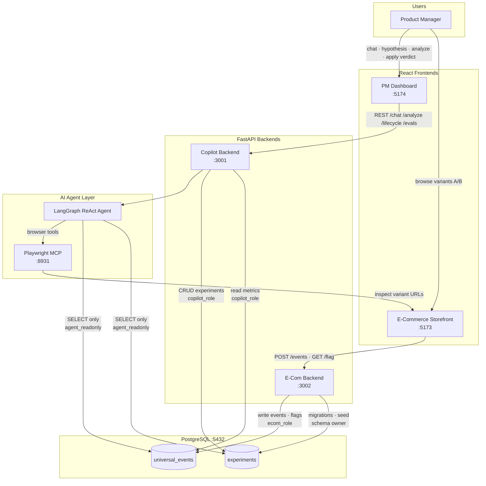
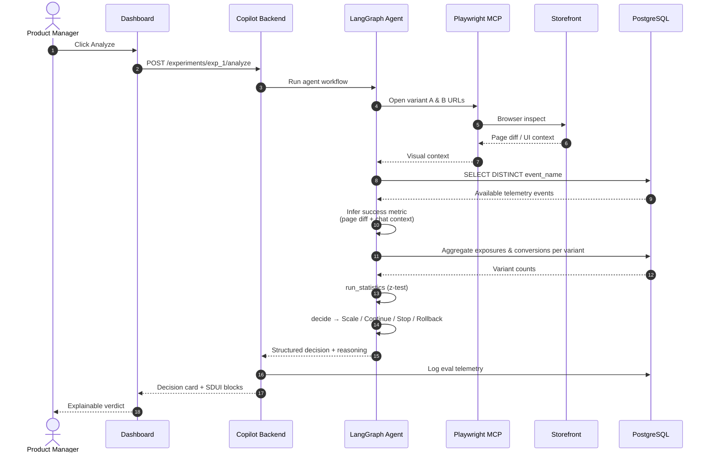
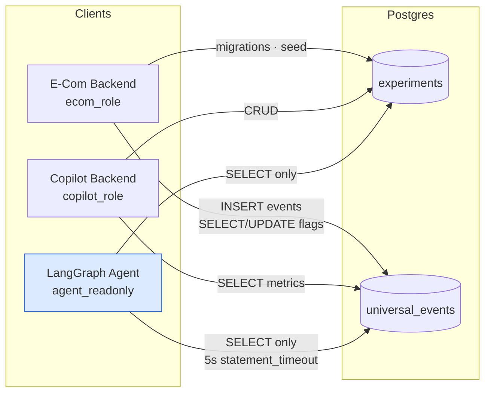

# AI Experiment Copilot — Architecture

## System Overview

## Agent Analysis Pipeline

## Data & Security Model

## Experiment Lifecycle (Copilot Features)

```mermaid
flowchart LR
    GOAL["Business Goal"] --> HYP["Generate Hypothesis"]
    HYP --> CFG["Recommend Config<br/>metric · URLs · preflight"]
    CFG --> LAUNCH["Launch / Simulate Traffic"]
    LAUNCH --> MON["Monitor Metrics<br/>auto-refresh dashboard"]
    MON --> ANA["One-Click Analyze"]
    ANA --> VER["Verdict<br/>Scale · Continue · Stop · Rollback"]
    VER --> ACT["Apply Recommendation<br/>traffic split 0% or 100%"]
    ACT --> EVAL["Eval Telemetry<br/>/evals dashboard"]

    style ANA fill:#2563eb,color:#fff
    style VER fill:#2563eb,color:#fff
    style EVAL fill:#0f172a,color:#fff
```

## Key Design Decisions

| Principle | Implementation |
|-----------|----------------|
| **Metric inferred, not configured** | `primary_metric` is NULL at seed; agent discovers events via SQL and picks metric from page diff |
| **Deterministic math** | LLM writes SQL and prose; z-test and verdict rules live in `statistics.py` |
| **Universal telemetry** | Single `universal_events` table — any client POSTs the same event shape |
| **Defense in depth** | Agent uses `agent_readonly` Postgres role; mutations rejected at DB layer |
| **Browser fallback** | Playwright MCP inspects real variant pages; falls back to chat-only if unavailable |
