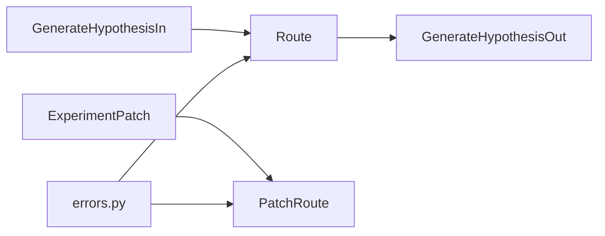

# Task 01: Schemas & Error Helpers

## Location

- **Package:** `packages/copilot-backend`
- **Files to create/modify:**
  - `app/schemas.py` — add request/response models
  - `app/errors.py` — **create** structured error helper module
  - `app/schemas.py` — extend `ExperimentPatch` for hypothesis/name fields

## Dependencies

- None (foundational task)
- Reference: [00-engineering-standards.md](../../00-engineering-standards.md) error contract

## What to build

### 1. Structured error module (`app/errors.py`)

Create reusable helpers aligned with engineering standards:

```python
def api_error(code: str, message: str, retryable: bool = False, details: dict | None = None) -> dict: ...

def raise_http_error(status_code: int, code: str, message: str, retryable: bool = False, details: dict | None = None) -> None: ...
```

HTTP status mapping must follow the standards table (`VALIDATION_ERROR` → 422, `LLM_UNAVAILABLE` → 503, etc.).

### 2. Request/response schemas (`app/schemas.py`)

```python
class GenerateHypothesisIn(BaseModel):
    businessGoal: str
    context: str = ""

class GenerateHypothesisOut(BaseModel):
    hypothesis: str
    suggestedName: str
    suggestedVariantAName: str = "Control"
    suggestedVariantBName: str = "Treatment"
    confidence: Literal["low", "medium", "high"] = "medium"
```

### 3. Extend `ExperimentPatch`

Add optional fields so "Accept & save" can PATCH without full upsert:

```python
class ExperimentPatch(BaseModel):
    # existing fields...
    hypothesis: Optional[str] = None
    name: Optional[str] = None
    variantAName: Optional[str] = None
    variantBName: Optional[str] = None
```

Update `patch_experiment` route handler to map these fields to DB columns.

### 4. Validation rules (Pydantic + route-level)

| Field | Rule | Error code |
|-------|------|------------|
| `businessGoal` | non-empty after strip | `VALIDATION_ERROR` |
| `businessGoal` | max 2000 chars | `VALIDATION_ERROR` |
| `context` | max 2000 chars (optional) | `VALIDATION_ERROR` |

Use Pydantic `field_validator` or route guard before calling service.

## Design spec

### Error response shape

```json
{
  "error": {
    "code": "VALIDATION_ERROR",
    "message": "Business goal is required.",
    "retryable": false,
    "details": { "field": "businessGoal" }
  }
}
```

### Schema dependency graph



## Done when

- [ ] `app/errors.py` exists with `api_error` and `raise_http_error`
- [ ] `GenerateHypothesisIn` / `GenerateHypothesisOut` defined in `schemas.py`
- [ ] `ExperimentPatch` supports `hypothesis`, `name`, `variantAName`, `variantBName`
- [ ] `PATCH /experiments/{id}` persists new patch fields
- [ ] Validation errors return 422 with structured body, no stack traces
- [ ] `copilot-backend` imports cleanly (`python -c "from app.main import app"`)
