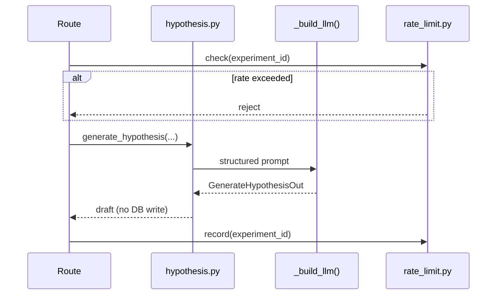

# Task 02: Hypothesis Service

## Location

- **Package:** `packages/copilot-backend`
- **Files to create/modify:**
  - `app/services/__init__.py` — **create** (empty package marker)
  - `app/services/hypothesis.py` — **create** core service
  - `app/services/rate_limit.py` — **create** in-memory rate limiter (shared utility)

## Dependencies

- Task 01 (schemas, error codes)
- Reuse `app/agent/graph.py::_build_llm()` for LLM provider consistency

## What to build

### 1. Rate limiter (`app/services/rate_limit.py`)

In-memory sliding window per `(experiment_id, action)`:

```python
class InMemoryRateLimiter:
    def check(self, key: str, limit: int, window_seconds: int) -> bool: ...
    def record(self, key: str) -> None: ...
```

For FR-01: key = `f"hypothesis:{experiment_id}"`, limit = 10, window = 3600s.
Return `False` when exceeded → route raises 429 `AGENT_TOOL_LIMIT` or dedicated `RATE_LIMIT_EXCEEDED` (document choice; prefer standards table code).

### 2. Core function (`app/services/hypothesis.py`)

```python
async def generate_hypothesis(
    *,
    business_goal: str,
    context: str,
    experiment: dict,
) -> GenerateHypothesisOut:
```

**Steps:**

1. Validate inputs (delegate to caller or re-validate).
2. Build system prompt:
   - Role: experiment design assistant for PMs.
   - Output: hypothesis framing only — **no metrics, no predicted results, no p-values**.
   - Include existing experiment name/hypothesis if present (for refinement).
3. Call LLM via `_build_llm()` with structured output:
   - Prefer Pydantic parser (`with_structured_output(GenerateHypothesisOut)`) or JSON mode + manual parse.
   - Temperature: 0 (match agent).
4. Timeout: 30s (`asyncio.wait_for` or LangChain timeout config).
5. On timeout/auth/model error → raise `LLM_UNAVAILABLE` (503, retryable).
6. **No DB writes** inside this function.

### 3. Prompt constraints (must be in code comments + prompt text)

- Do not invent event names or conversion rates.
- Hypothesis must be one clear sentence comparing Variant B to Variant A.
- `suggestedName` ≤ 80 chars, human-readable.
- Variant names are descriptive labels, not code identifiers.

### 4. Logging

- INFO: `experiment_id`, goal length, confidence, latency ms.
- WARN: rate limit hit, LLM retry.
- ERROR: unexpected parse failure (return 502 `INTERNAL_ERROR` with safe message).

## Design spec

### LLM input template

```
System: You help PMs draft A/B test hypotheses. Output structured JSON only.
Never invent metrics, sample sizes, or expected lift.

User:
Business goal: {business_goal}
Additional context: {context}
Current experiment name: {name}
Current hypothesis (if any): {hypothesis}

Generate a testable hypothesis comparing Variant B (treatment) to Variant A (control).
```

### Data flow



### Example successful output

```json
{
  "hypothesis": "Variant B's redesigned checkout CTA increases checkout_completed conversion vs Variant A on mobile.",
  "suggestedName": "Checkout CTA Redesign — Mobile",
  "suggestedVariantAName": "Original CTA",
  "suggestedVariantBName": "Redesigned CTA",
  "confidence": "medium"
}
```

## Done when

- [ ] `app/services/hypothesis.py` exports `generate_hypothesis`
- [ ] Uses `_build_llm()` from graph module (no duplicate LLM config)
- [ ] 30s timeout enforced; failures map to `LLM_UNAVAILABLE`
- [ ] Rate limiter integrated (called from route in Task 03)
- [ ] No database mutations in service layer
- [ ] Prompt explicitly forbids inventing metrics/results
- [ ] Unit-testable: function accepts plain dict experiment, returns Pydantic model
