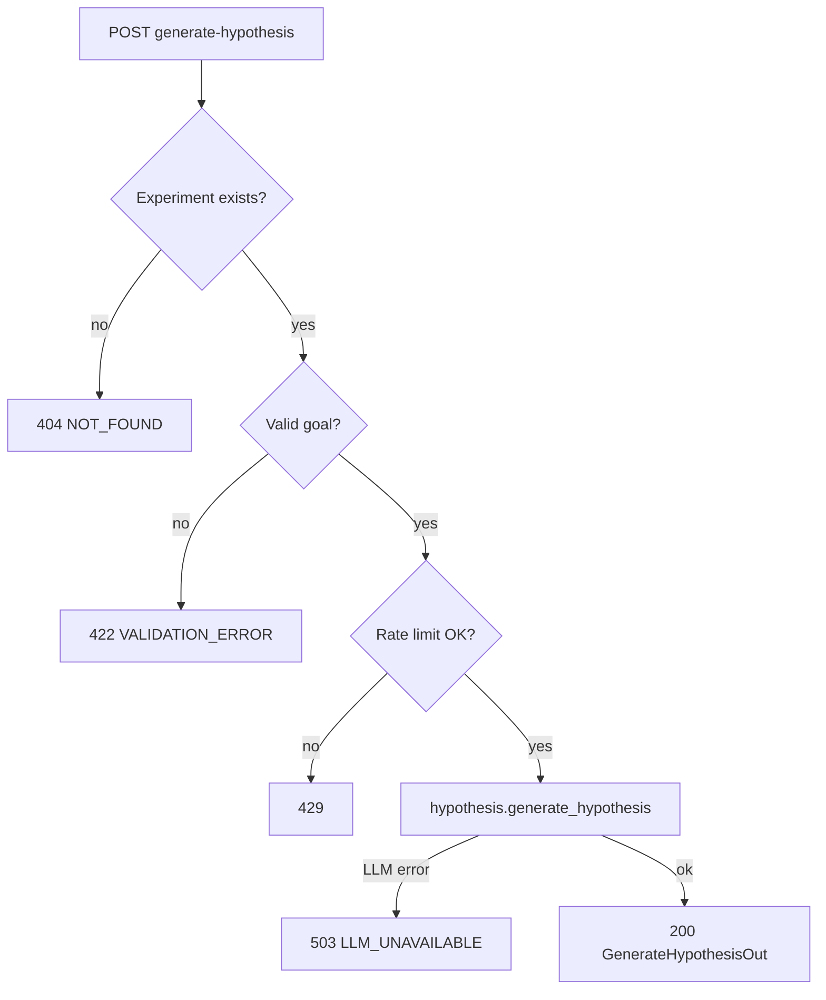

# Task 03: Generate-Hypothesis Route

## Location

- **Package:** `packages/copilot-backend`
- **Files to create/modify:**
  - `app/routes/experiments.py` — add `POST /experiments/{id}/generate-hypothesis`
  - `app/main.py` — no change if route added to existing router

## Dependencies

- Task 01 (schemas, errors, extended PATCH)
- Task 02 (`generate_hypothesis` service, rate limiter)

## What to build

### Endpoint: `POST /experiments/{experiment_id}/generate-hypothesis`

**Request body:** `GenerateHypothesisIn`

**Response 200:** `GenerateHypothesisOut`

**Errors:**

| HTTP | Code | When |
|------|------|------|
| 404 | `NOT_FOUND` | experiment_id missing |
| 422 | `VALIDATION_ERROR` | empty goal, goal/context > 2000 chars |
| 429 | `AGENT_TOOL_LIMIT` | > 10 generations / hour / experiment |
| 503 | `LLM_UNAVAILABLE` | LLM timeout or auth failure |
| 500 | `INTERNAL_ERROR` | unexpected (no stack trace in body) |

### Route handler flow

```python
@router.post("/experiments/{experiment_id}/generate-hypothesis")
async def generate_hypothesis_route(experiment_id: str, body: GenerateHypothesisIn):
```

1. Load experiment row from DB (`SELECT * FROM experiments WHERE id = :id`).
2. If missing → 404.
3. Validate `businessGoal` (strip, length) → 422.
4. Check rate limit → 429.
5. Call `await generate_hypothesis(business_goal=..., context=..., experiment=exp_dict)`.
6. Record rate limit hit on success.
7. Return 200 JSON (camelCase via Pydantic `model_dump(by_alias=True)` if aliases added).

### PATCH extension (same file)

Extend existing `patch_experiment` to handle:

| Patch field | DB column |
|-------------|-----------|
| `hypothesis` | `hypothesis` |
| `name` | `name` |
| `variantAName` | `variant_a_name` |
| `variantBName` | `variant_b_name` |

This enables dashboard "Accept & save" without requiring full POST upsert.

### Correlation logging

Generate `request_id = uuid4()` at route entry; log on INFO/WARN/ERROR.

## Design spec

### API contract

**Request**

```json
POST /experiments/exp_1/generate-hypothesis
Content-Type: application/json

{
  "businessGoal": "Increase checkout conversion on mobile",
  "context": "We changed the checkout CTA on variant B"
}
```

**Response 200**

```json
{
  "hypothesis": "Variant B's redesigned checkout CTA increases checkout_completed conversion vs Variant A on mobile.",
  "suggestedName": "Checkout CTA Redesign — Mobile",
  "suggestedVariantAName": "Original CTA",
  "suggestedVariantBName": "Redesigned CTA",
  "confidence": "medium"
}
```

**Response 503**

```json
{
  "error": {
    "code": "LLM_UNAVAILABLE",
    "message": "Hypothesis generation is temporarily unavailable. Enter your hypothesis manually.",
    "retryable": true,
    "details": {}
  }
}
```

### Route architecture



## Done when

- [ ] `POST /experiments/{id}/generate-hypothesis` registered and documented
- [ ] All error codes match engineering standards
- [ ] Rate limit enforced per experiment
- [ ] PATCH supports hypothesis + name + variant names
- [ ] `curl` smoke test returns 200 for valid goal on seeded `exp_1`
- [ ] Empty goal returns 422 with structured error
- [ ] No raw exception strings in response body
