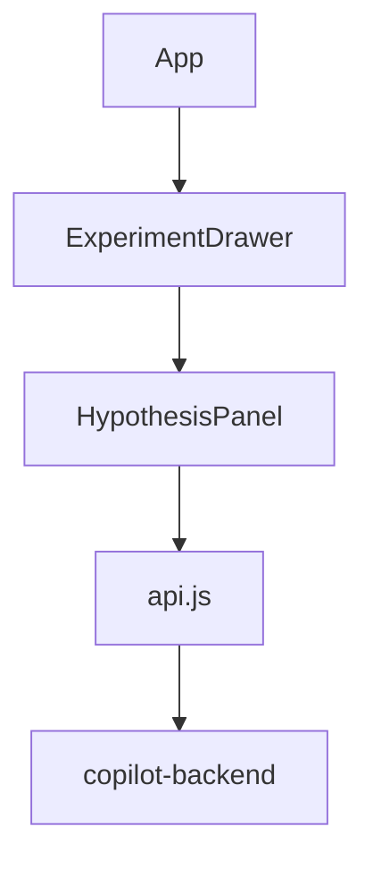

# Task 04: Dashboard Hypothesis Panel

## Location

- **Package:** `packages/dashboard`
- **Files to create/modify:**
  - `src/components/HypothesisPanel.jsx` — **create** new component
  - `src/components/ExperimentDrawer.jsx` — embed panel section
  - `src/App.jsx` — pass experiment data + refresh callback
  - `src/styles.css` — panel-specific styles (match existing drawer patterns)

## Dependencies

- Task 03 (API endpoints live)
- Task 05 (api.js client functions)
- [00-engineering-standards.md](../../00-engineering-standards.md) loading/error UX

## What to build

### Component: `HypothesisPanel.jsx`

**Props:**

```javascript
{
  experimentId: string,
  experiment: { name, hypothesis, variant_a_name, variant_b_name, ... },
  onSaved: () => Promise<void>,  // refresh experiment after save
  setError: (msg: string) => void,
}
```

**Local state:**

- `businessGoal` (textarea)
- `context` (optional textarea, collapsed by default)
- `draft` — null | GenerateHypothesisOut shape
- `editableHypothesis`, `editableName`, `editableVariantA`, `editableVariantB`
- `generating` boolean
- `saving` boolean

**Actions:**

1. **Generate hypothesis** — calls `generateHypothesis(experimentId, { businessGoal, context })`
2. **Accept & save** — calls `saveHypothesis(experimentId, { hypothesis, name, variantAName, variantBName })` via PATCH

### UI layout (ASCII wireframe)

```
┌─ Hypothesis ─────────────────────────────────────┐
│ Business goal *                                 │
│ ┌─────────────────────────────────────────────┐ │
│ │ Increase checkout conversion on mobile      │ │
│ └─────────────────────────────────────────────┘ │
│ [+] Add context (optional)                      │
│                                                 │
│ [ Generate hypothesis ]  (spinner when busy)    │
│                                                 │
│ ── Draft ─────────────────────────────────────  │
│ Experiment name                                 │
│ ┌─────────────────────────────────────────────┐ │
│ │ Checkout CTA Redesign — Mobile              │ │
│ └─────────────────────────────────────────────┘ │
│ Hypothesis                                      │
│ ┌─────────────────────────────────────────────┐ │
│ │ Variant B's redesigned checkout CTA…        │ │
│ └─────────────────────────────────────────────┘ │
│ Variant A name    │ Variant B name              │
│ [ Original CTA  ] │ [ Redesigned CTA          ] │
│                                                 │
│ [ Accept & save ]                               │
│                                                 │
│ ⚠ LLM unavailable — enter hypothesis manually   │
└─────────────────────────────────────────────────┘
```

### UX rules

- Pre-fill editable hypothesis from `experiment.hypothesis` on load.
- After successful generate, populate all draft fields; PM can edit before save.
- On 503 `LLM_UNAVAILABLE`: show inline warning + keep manual fields editable (do not clear user input).
- Disable Generate when goal empty or `generating`.
- Disable Accept & save when hypothesis empty or `saving`.
- Character counter on business goal (max 2000).

### Integration in `ExperimentDrawer.jsx`

Add new `<section className="drawer-section">` above traffic allocation:

```jsx
<HypothesisPanel
  experimentId={experimentId}
  experiment={experiment}
  onSaved={onRefresh}
  setError={setError}
/>
```

Pass `experiment` and `experimentId` from `App.jsx` (already loads via `getExperiment`).

### Styles

Reuse existing classes: `drawer-section`, `field-label`, `drawer-input`, `btn`, `btn-secondary`, `error`.
Add: `hypothesis-textarea` (min-height), `char-count`, `draft-panel` (subtle border).

## Design spec

### Component hierarchy



### State transitions

| Event | State change |
|-------|--------------|
| Generate click | `generating=true` → API → populate draft → `generating=false` |
| Generate fail 503 | show fallback message, `draft=null`, manual fields remain |
| Accept click | `saving=true` → PATCH → `onSaved()` → `saving=false` |
| Reload experiment | sync editable fields from server hypothesis |

## Done when

- [ ] `HypothesisPanel.jsx` renders in Experiment drawer
- [ ] Generate shows loading spinner and disables button
- [ ] 503 shows "Enter hypothesis manually" without crash
- [ ] Accept & save persists and refreshes dashboard experiment data
- [ ] Saved hypothesis visible after page reload
- [ ] Goal validation prevents empty generate (client-side + server 422 handled)
- [ ] Matches existing dashboard visual language (dark theme, drawer spacing)
