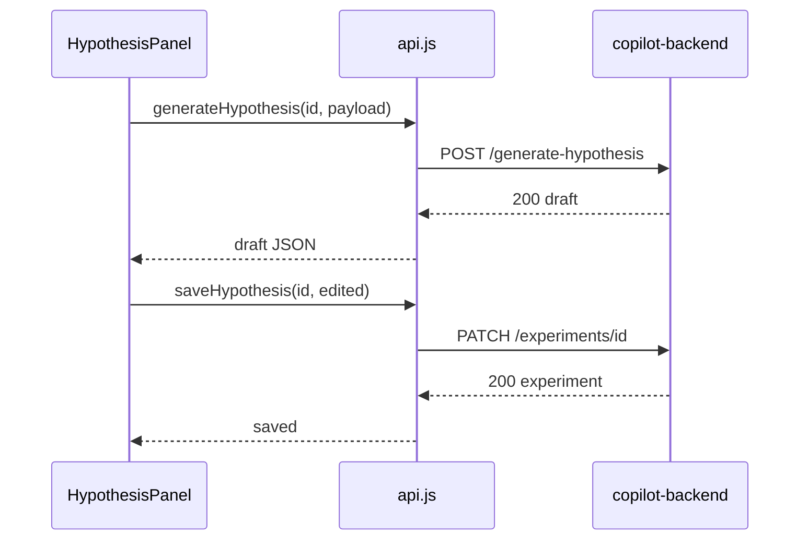

# Task 05: API Client — Hypothesis

## Location

- **Package:** `packages/dashboard`
- **Files to create/modify:**
  - `src/api.js` — add `generateHypothesis`, `saveHypothesis`, `parseApiError`

## Dependencies

- Task 03 (backend routes deployed)
- Engineering standards error shape

## What to build

### 1. Error parser (`parseApiError`)

Centralize structured error handling for all new FR endpoints:

```javascript
export async function parseApiError(res) {
  const body = await res.json().catch(() => ({}));
  if (body?.error?.message) {
    const err = new Error(body.error.message);
    err.code = body.error.code;
    err.retryable = body.error.retryable ?? false;
    err.details = body.error.details ?? {};
    return err;
  }
  return new Error(body.detail || body.error || `Request failed (${res.status})`);
}
```

Refactor existing `analyze` / `chat` error paths to use this helper (optional, minimal touch).

### 2. `generateHypothesis`

```javascript
export async function generateHypothesis(id, { businessGoal, context = '' }) {
  const res = await fetch(`${API_BASE}/experiments/${id}/generate-hypothesis`, {
    method: 'POST',
    headers: { 'Content-Type': 'application/json' },
    body: JSON.stringify({ businessGoal, context }),
  });
  if (!res.ok) throw await parseApiError(res);
  return res.json();
}
```

### 3. `saveHypothesis`

Uses extended PATCH from Task 01/03:

```javascript
export async function saveHypothesis(id, { hypothesis, name, variantAName, variantBName }) {
  const body = {};
  if (hypothesis != null) body.hypothesis = hypothesis;
  if (name != null) body.name = name;
  if (variantAName != null) body.variantAName = variantAName;
  if (variantBName != null) body.variantBName = variantBName;

  const res = await fetch(`${API_BASE}/experiments/${id}`, {
    method: 'PATCH',
    headers: { 'Content-Type': 'application/json' },
    body: JSON.stringify(body),
  });
  if (!res.ok) throw await parseApiError(res);
  return res.json();
}
```

Alternative: use existing `POST /experiments` upsert if PATCH not yet extended — document preference for PATCH (partial update).

### 4. TypeScript/JSDoc comments (optional)

Add JSDoc for return shapes to aid future TS migration:

```javascript
/** @returns {Promise<{ hypothesis: string, suggestedName: string, ... }>} */
```

## Design spec

### Client error mapping for UI

| `err.code` | UI behavior |
|------------|-------------|
| `VALIDATION_ERROR` | Inline field error on business goal |
| `LLM_UNAVAILABLE` | Banner: "Enter hypothesis manually" + keep fields editable |
| `NOT_FOUND` | Global drawer error |
| `AGENT_TOOL_LIMIT` (rate limit) | "Try again in an hour" message |
| default | `setError(err.message)` |

### Request/response flow



## Done when

- [ ] `generateHypothesis` and `saveHypothesis` exported from `api.js`
- [ ] `parseApiError` surfaces `code`, `message`, `retryable`
- [ ] 503 errors distinguishable in UI via `err.code === 'LLM_UNAVAILABLE'`
- [ ] `npm run build` succeeds in dashboard package
- [ ] Functions use camelCase JSON keys matching backend Pydantic models
