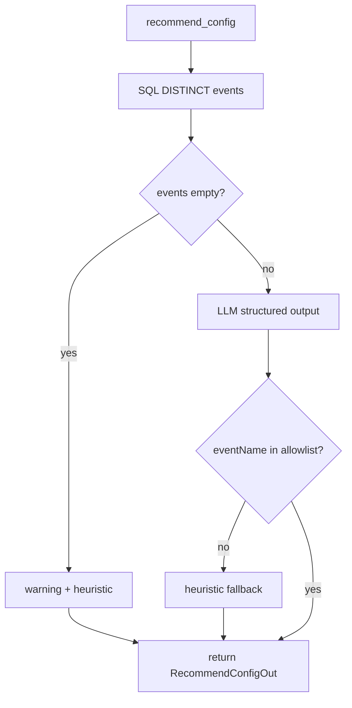

# Task 02: Config Recommendation Service

## Location

- **Package:** `packages/copilot-backend`
- **Files to create/modify:**
  - `app/services/config_recommendation.py` — **create**
  - `app/agent/graph.py` — optionally export `_deep_link_checkout` to shared util (minimal: duplicate import-safe helper in service if needed)

## Dependencies

- Task 01 (response schemas)
- Task 01 FR-01 (`_build_llm()`)
- DB access via `app/db.py::engine`

## What to build

### Main function

```python
async def recommend_config(
    *,
    experiment_id: str,
    hypothesis: str,
    variant_a_url: str | None,
    variant_b_url: str | None,
    experiment: dict,
) -> RecommendConfigOut:
```

### Step 1 — Deterministic event discovery (no LLM)

```sql
SELECT DISTINCT event_name
FROM universal_events
WHERE experiment_id = :id
ORDER BY event_name;
```

Store as `available_events: list[str]`.

If empty:
- Return response with `warning: "No events collected yet. Run traffic simulation or wait for live data."`
- Heuristic primary metric: `page_view` if somehow present else first funnel event name from static fallback list
- Skip LLM metric selection OR call LLM with empty allowlist guard

### Step 2 — Heuristic fallback (deterministic)

```python
def heuristic_primary_metric(events: list[str]) -> str:
    priority = ["checkout_completed", "checkout_started", "add_to_cart", "page_view"]
    for e in priority:
        if e in events:
            return e
    return events[0] if events else "page_view"
```

### Step 3 — LLM selection (when events exist)

Prompt inputs:
- `hypothesis`
- `variant_a_url`, `variant_b_url` (from request or experiment row)
- `available_events` (explicit allowlist — model MUST pick from this list only)
- Brief note: page_view is exposure, not conversion

Structured output schema matching `PrimaryMetricRecommendation` + `FeatureFlagRecommendation` + `AudienceRecommendation`.

**Guardrail:** After LLM returns, validate:

```python
if primary.eventName not in available_events:
    primary.eventName = heuristic_primary_metric(available_events)
    primary.rationale += " (Adjusted: LLM pick was not in available events.)"
```

Filter `alternatives` to only events in allowlist.

### Step 4 — Feature flag narrative

LLM generates descriptive summary only — no real flag SDK keys required.

Default `suggestedTrafficSplit` from experiment `traffic_split` or 50.

### Step 5 — No auto-save

Service returns recommendation only; persistence is explicit PATCH from UI.

### Logging

- INFO: experiment_id, available_events count, chosen metric, LLM latency
- WARN: LLM invalid pick corrected, zero events

## Design spec

### Data flow



### LLM prompt excerpt

```
You recommend A/B experiment configuration for a PM.
ALLOWED primary metric event names (pick exactly one): {available_events}
Do NOT recommend events outside this list.
Hypothesis: {hypothesis}
Variant A URL: {variant_a_url}
Variant B URL: {variant_b_url}

Return JSON with primaryMetric, featureFlag, audience.
page_view counts exposures, not conversions.
```

### Conversion vs exposure guidance

| Event | Role |
|-------|------|
| `page_view` | Exposure denominator |
| `checkout_completed` | Preferred conversion if in list |
| `add_to_cart` | Mid-funnel alternative |

## Done when

- [ ] `app/services/config_recommendation.py` implements `recommend_config`
- [ ] SQL uses parameterized query via SQLAlchemy `text()`
- [ ] LLM pick validated against allowlist with heuristic fallback
- [ ] `alternatives` filtered to valid events only
- [ ] Zero-events case returns warning, does not 500
- [ ] No DB writes in service
- [ ] Function unit-testable with mocked LLM + mocked DB
