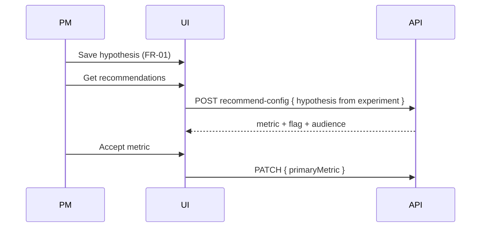

# Task 03: Recommend-Config Route

## Location

- **Package:** `packages/copilot-backend`
- **Files to create/modify:**
  - `app/routes/experiments.py` — add `POST /experiments/{id}/recommend-config`
  - `app/routes/experiments.py` — extend PATCH for `primaryMetric`, `audienceNote`

## Dependencies

- Task 01 (schemas)
- Task 02 (`recommend_config` service)
- FR-01 Task 01 (`app/errors.py`)

## What to build

### Endpoint: `POST /experiments/{experiment_id}/recommend-config`

**Request:** `RecommendConfigIn`

**Response 200:** `RecommendConfigOut`

**Errors:**

| HTTP | Code | When |
|------|------|------|
| 404 | `NOT_FOUND` | experiment missing |
| 422 | `VALIDATION_ERROR` | invalid URL format |
| 503 | `LLM_UNAVAILABLE` | LLM failure (when events exist and LLM required) |
| 502 | `UPSTREAM_ERROR` | DB unreachable |

### Route handler flow

1. Load experiment from DB.
2. Resolve URLs: `body.variantAUrl or exp["variant_a_url"]`, same for B.
3. Resolve hypothesis: `body.hypothesis or exp["hypothesis"] or ""`.
4. Call `await recommend_config(...)`.
5. Return 200 with camelCase JSON.

### PATCH extension

Map `primaryMetric` → `primary_metric`, `audienceNote` → `audience_note` (if column exists).

Existing POST upsert already supports `primaryMetric` via `ExperimentIn`.

## Design spec

### API contract

**Request**

```json
POST /experiments/exp_1/recommend-config
Content-Type: application/json

{
  "hypothesis": "Variant B's redesigned checkout CTA increases conversion.",
  "variantAUrl": "http://localhost:5173/?variant=A",
  "variantBUrl": "http://localhost:5173/?variant=B"
}
```

**Response 200 (seeded data)**

```json
{
  "primaryMetric": {
    "eventName": "checkout_completed",
    "rationale": "…",
    "alternatives": ["checkout_started", "add_to_cart"]
  },
  "featureFlag": {
    "summary": "Treat variant B checkout hero CTA as the treatment flag.",
    "suggestedTrafficSplit": 50
  },
  "audience": {
    "suggestion": "All users",
    "note": "Audience targeting not enforced in v1.5; stored for documentation."
  },
  "availableEvents": ["page_view", "add_to_cart", "checkout_started", "checkout_completed"]
}
```

### Sequence with FR-01



## Done when

- [ ] Route registered on experiments router
- [ ] URL/hypothesis fallback from experiment row works
- [ ] PATCH persists `primaryMetric`
- [ ] curl smoke test on seeded `exp_1` returns valid event names only
- [ ] All errors use structured `error` object
- [ ] Response includes `availableEvents` array
