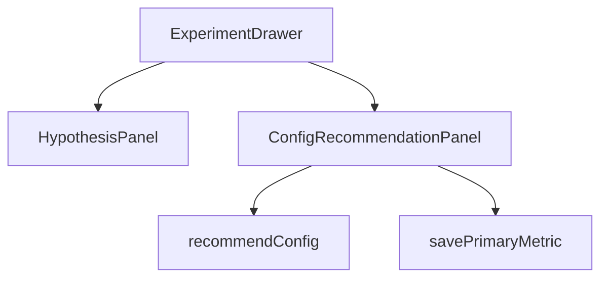

# Task 04: Dashboard Config Panel

## Location

- **Package:** `packages/dashboard`
- **Files to create/modify:**
  - `src/components/ConfigRecommendationPanel.jsx` — **create**
  - `src/components/ExperimentDrawer.jsx` — embed below HypothesisPanel
  - `src/App.jsx` — pass experiment + variant URL state
  - `src/styles.css` — recommendation card styles

## Dependencies

- Task 03 (API)
- Task 05 (api.js)
- FR-01 HypothesisPanel (optional chaining: use saved hypothesis)

## What to build

### Component: `ConfigRecommendationPanel.jsx`

**Props:**

```javascript
{
  experimentId: string,
  experiment: object,
  onSaved: () => Promise<void>,
  setError: (msg: string) => void,
}
```

**Local state:**

- `loading`, `recommendation` (RecommendConfigOut shape)
- `variantAUrl`, `variantBUrl` (editable; default from experiment row)
- `selectedMetric` (editable dropdown from `availableEvents`)
- `accepted` boolean

### UI layout (ASCII wireframe)

```
┌─ Measurement plan ───────────────────────────────┐
│ Variant A URL                                   │
│ [ http://localhost:5173/?variant=A            ] │
│ Variant B URL                                   │
│ [ http://localhost:5173/?variant=B            ] │
│                                                 │
│ [ Get recommendations ]                         │
│                                                 │
│ ── Primary metric ────────────────────────────  │
│ ● checkout_completed                            │
│   "Variant diff is checkout CTA; …"             │
│ Alternatives: checkout_started, add_to_cart     │
│                                                 │
│ ── Feature flag (documentation) ───────────────  │
│ Treat variant B checkout hero CTA as treatment. │
│ Suggested split: 50%                            │
│                                                 │
│ ── Audience ──────────────────────────────────  │
│ All users (not enforced in v1.5)                │
│                                                 │
│ ⚠ No events yet — simulate traffic first        │
│                                                 │
│ [ Accept metric ]                               │
└─────────────────────────────────────────────────┘
```

### Interactions

1. **Get recommendations** — POST with hypothesis from `experiment.hypothesis`, URLs from fields.
2. Show rationale and alternatives as read-only list.
3. **Accept metric** — PATCH `primaryMetric: selectedMetric`.
4. If `warning` present, show amber banner above results.
5. Disable Accept until recommendation loaded.

### Display current metric

If `experiment.primary_metric` already set, show badge "Current: checkout_completed" and allow re-recommend.

## Design spec

### Component hierarchy



### Metric selection UX

- Primary recommendation pre-selected in dropdown (`availableEvents`).
- Alternatives shown as chips below rationale.
- Ruled-out events: not shown unless in `availableEvents` (service never returns invalid names).

## Done when

- [ ] Panel renders in Experiment drawer
- [ ] Get recommendations shows loading state
- [ ] Warning banner for zero events
- [ ] Accept metric PATCH succeeds and refreshes experiment
- [ ] Saved `primary_metric` reflected in Metrics panel after refresh
- [ ] URLs editable and passed to API
- [ ] Error states handled via `setError` / inline messages
