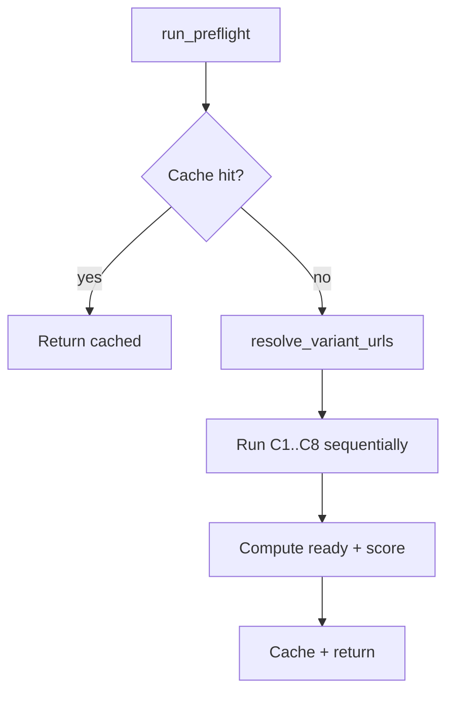

# Task 01: Preflight Service Core

## Location

- **Package:** `packages/copilot-backend`
- **Files to create/modify:**
  - `app/services/preflight.py` — **create** orchestrator + models
  - `app/services/preflight_cache.py` — **create** optional 60s TTL cache (can live in same file)

## Dependencies

- Task 02 (individual check functions imported into orchestrator)
- `app/db.py::engine`

## What to build

### Check result model

```python
from enum import Enum
from pydantic import BaseModel
from datetime import datetime

class CheckStatus(str, Enum):
    pass_ = "pass"  # serialize as "pass"
    warn = "warn"
    fail = "fail"

class PreflightCheck(BaseModel):
    id: str
    name: str
    status: CheckStatus
    message: str

class PreflightResult(BaseModel):
    ready: bool
    score: str  # e.g. "6/8"
    checks: list[PreflightCheck]
    evaluatedAt: datetime
```

Use Pydantic alias or field serializer so JSON shows `"pass"` not `"pass_"`.

### Orchestrator

```python
async def run_preflight(
    *,
    experiment_id: str,
    experiment: dict,
    variant_a_url: str | None,
    variant_b_url: str | None,
    conn,  # SQLAlchemy connection
) -> PreflightResult:
```

**Flow:**

1. Check cache: key `preflight:{experiment_id}:{url_hash}` — if hit and age < 60s, return cached.
2. Run checks in **stable order** (each isolated — failure in one does not skip others):
   - C1b → C1 → C2 → C3 → C4 → C5 → C6 → C7 → C8
3. Compute `ready = not any(c.status == fail for c in checks)`.
4. Compute `score = f"{pass_count + warn_count treated?}/{total}"` — **spec:** score counts pass only vs total checks, format `"6/8"` where numerator = pass count, denominator = total checks (warn does not increment pass).
5. Set `evaluatedAt = utcnow()`.
6. Store in cache; return.

**Score rule (explicit):**

```python
passed = sum(1 for c in checks if c.status == "pass")
score = f"{passed}/{len(checks)}"
```

### Cache

```python
_cache: dict[str, tuple[PreflightResult, float]] = {}
CACHE_TTL_SECONDS = 60
```

Invalidate on experiment PATCH (optional enhancement) — not required for hackathon.

### Shared URL resolver

```python
def resolve_variant_urls(
    experiment: dict,
    query_a: str | None,
    query_b: str | None,
) -> tuple[str | None, str | None, PreflightCheck | None]:
    """
    Returns (url_a, url_b, optional C1b check result).
    Priority: query params > experiment row > None.
    """
```

If both URLs missing → C1b = `warn` with message from FR source.

### Export check registry

```python
CHECK_ORDER = ["C1b", "C1", "C2", "C3", "C4", "C5", "C6", "C7", "C8"]
```

## Design spec

### Orchestration diagram



### Response envelope

```json
{
  "ready": false,
  "score": "4/8",
  "checks": [
    { "id": "C1b", "name": "Variant URLs provided", "status": "pass", "message": "…" }
  ],
  "evaluatedAt": "2026-07-24T20:00:00Z"
}
```

## Done when

- [ ] `PreflightCheck`, `PreflightResult` models defined
- [ ] `run_preflight` runs all checks in stable order
- [ ] `ready` false iff any `fail`
- [ ] 60s cache implemented
- [ ] Pure orchestration — individual check logic in Task 02
- [ ] Unit-testable with mocked check functions
