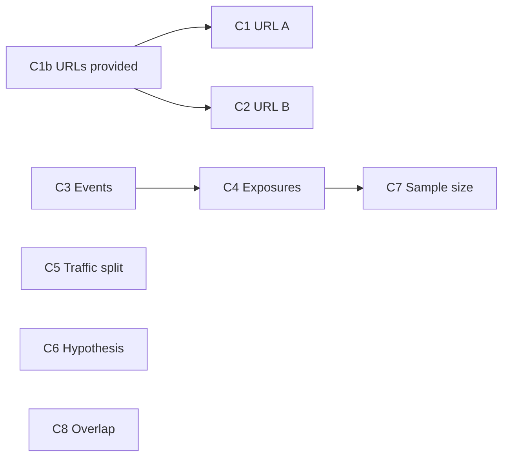

# Task 02: URL and DB Checks

## Location

- **Package:** `packages/copilot-backend`
- **Files to create/modify:**
  - `app/services/preflight.py` — individual check functions
  - `app/services/url_check.py` — **create** httpx URL reachability helper
  - `app/agent/graph.py` — extract `_deep_link_checkout` to `app/services/url_utils.py` **or** duplicate minimal helper in `url_check.py` (prefer shared `url_utils.py` to avoid drift)

## Dependencies

- Task 01 (check models)
- `httpx` added to copilot-backend dependencies if not present

## What to build

### URL utilities (`app/services/url_utils.py`)

Port from `graph.py`:

```python
def deep_link_checkout(url: str) -> str:
    """Append screen=checkout when URL has no screen param."""
```

```python
def docker_reachable_url(url: str) -> str:
    """Rewrite localhost hostnames for container-to-container fetch if needed."""
```

Match `_browser_url` behavior from graph if storefront fetch runs inside Docker (host `ecom` vs `localhost`).

### URL check helper (`app/services/url_check.py`)

```python
async def check_url_reachable(url: str, *, timeout: float = 5.0) -> tuple[str, int | None, float | None]:
    """
    Returns (status: pass|warn|fail, http_code, latency_ms).
    Uses GET or HEAD via httpx.
    pass: 2xx/3xx within timeout
    warn: slow response (>3s) but success
    fail: timeout, connection error, 4xx/5xx
    """
```

Apply `deep_link_checkout(url)` before fetch.

### Check implementations

#### C1b — URLs provided

| Condition | Status |
|-----------|--------|
| Both URLs from query or DB | pass |
| One URL only | warn ("Only one variant URL configured") |
| Neither | warn ("Paste variant URLs in chat or save them on the experiment before launch.") |

#### C1 / C2 — URL reachable

- Skip with `warn` "URL not provided" if URL missing (do not fail — C1b already warned).
- Else run `check_url_reachable`.
- Message examples: `"HTTP 200 in 120ms"`, `"Connection refused: http://…"`.

#### C3 — Events exist

```sql
SELECT COUNT(*) FROM universal_events WHERE experiment_id = :id
```

| Count | Status |
|-------|--------|
| 0 | fail |
| 1–99 | warn |
| ≥ 100 | pass |

#### C4 — Exposures per variant

```sql
SELECT variant_id, COUNT(*) AS n
FROM universal_events
WHERE experiment_id = :id AND event_name = 'page_view'
GROUP BY variant_id
```

| A exp | B exp | Status |
|-------|-------|--------|
| ≥1 | ≥1 | pass |
| one 0 | other ≥1 | warn |
| both 0 | | fail |

#### C5 — Traffic split

Read `experiment["traffic_split"]`:

| Value | Status |
|-------|--------|
| 0–100 int | pass (warn if 0 or 100: "One variant receives no traffic") |
| null/invalid | fail |

#### C6 — Hypothesis non-empty

| `experiment["hypothesis"]` | Status |
|----------------------------|--------|
| strip non-empty | pass |
| empty/null | fail |

#### C7 — Sample size guidance

Use `page_view` counts from C4 query:

| min(A,B) | Status |
|----------|--------|
| ≥ 300 | pass |
| 50–299 | warn |
| < 50 | fail |

Message includes actual counts.

#### C8 — Overlap (best-effort)

```sql
SELECT user_id, COUNT(DISTINCT experiment_id) AS n
FROM universal_events
GROUP BY user_id
HAVING COUNT(DISTINCT experiment_id) > 1
LIMIT 5;
```

Also count distinct experiments:

```sql
SELECT COUNT(DISTINCT experiment_id) FROM universal_events;
```

| Condition | Status |
|-----------|--------|
| only 1 experiment in system | pass, note "single experiment in system" |
| overlap rows found | fail, list up to 5 user_ids |
| multiple exps, no overlap | pass |

## Design spec

### Check dependency on data



### Example check messages

| ID | pass example | fail example |
|----|--------------|--------------|
| C1 | HTTP 200 in 120ms | Unreachable: http://localhost:5173/?variant=A — connection refused |
| C3 | 10,000 events recorded | No events for experiment exp_1 |
| C6 | Hypothesis configured | Hypothesis is empty — use Generate hypothesis or enter manually |
| C8 | Single experiment in system | 3 users appear in multiple experiments |

## Done when

- [ ] All 8 checks implemented as pure/testable functions
- [ ] URL checks use 5s timeout and deep_link_checkout
- [ ] SQL checks use parameterized queries
- [ ] C1/C2 still run when other checks fail
- [ ] Stable check IDs and human-readable names
- [ ] httpx dependency declared in copilot-backend requirements
