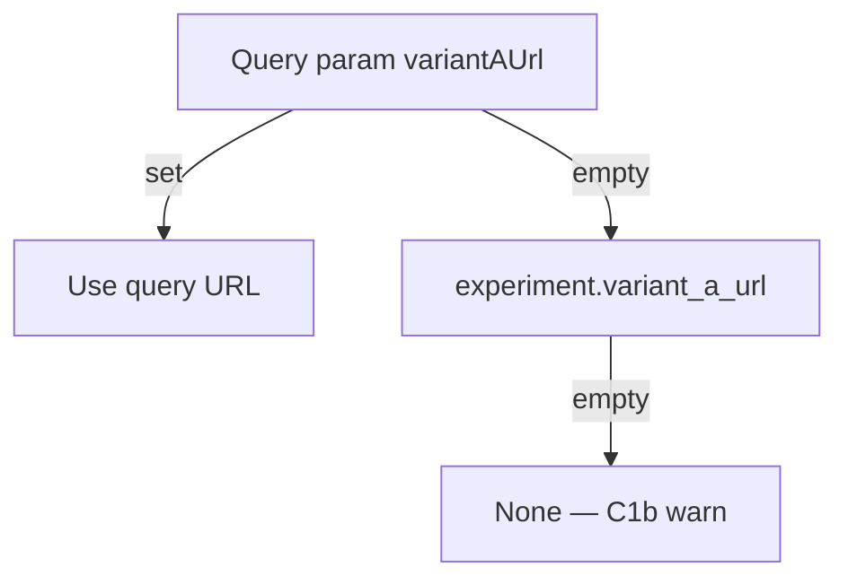

# Task 03: Preflight Route

## Location

- **Package:** `packages/copilot-backend`
- **Files to create/modify:**
  - `app/routes/experiments.py` — add `GET /experiments/{id}/preflight`
  - `app/schemas.py` — optional query param model (or inline FastAPI Query)

## Dependencies

- Task 01 (`run_preflight`)
- Task 02 (check implementations wired)
- FR-01 Task 01 (`app/errors.py`)

## What to build

### Endpoint: `GET /experiments/{experiment_id}/preflight`

**Query parameters (optional overrides):**

| Param | Type | Description |
|-------|------|-------------|
| `variantAUrl` | string | Override stored variant A URL |
| `variantBUrl` | string | Override stored variant B URL |

Example:

```
GET /experiments/exp_1/preflight?variantAUrl=http://localhost:5173/?variant=A&variantBUrl=http://localhost:5173/?variant=B
```

**Response 200:** `PreflightResult`

**Errors:**

| HTTP | Code | When |
|------|------|------|
| 404 | `NOT_FOUND` | experiment missing |
| 503 | `UPSTREAM_ERROR` | DB connection failure |
| 500 | `INTERNAL_ERROR` | unexpected (no stack trace) |

### Route handler

```python
@router.get("/experiments/{experiment_id}/preflight")
async def preflight(
    experiment_id: str,
    variantAUrl: str | None = None,
    variantBUrl: str | None = None,
):
```

1. Load experiment; 404 if missing.
2. Open DB connection.
3. Call `await run_preflight(experiment_id=..., experiment=..., variant_a_url=variantAUrl, variant_b_url=variantBUrl, conn=...)`.
4. Return JSON with ISO8601 `evaluatedAt`.

### Error handling

- Wrap DB errors → 503 `"Cannot reach experiment data."`
- URL check exceptions caught per-check in Task 02 (never 500 whole request for one bad URL)

### Performance

- Target p95 < 10s with two URL checks (5s timeout each worst case → run C1/C2 sequentially; consider asyncio.gather for parallel URL checks to halve latency).

**Recommendation:** run C1 and C2 concurrently via `asyncio.gather`.

## Design spec

### API contract

**Request**

```http
GET /experiments/exp_1/preflight?variantAUrl=http://ecom:5173/?variant=A&variantBUrl=http://ecom:5173/?variant=B
```

**Response 200**

```json
{
  "ready": true,
  "score": "7/8",
  "checks": [
    {
      "id": "C1b",
      "name": "Variant URLs provided",
      "status": "pass",
      "message": "Both variant URLs configured."
    },
    {
      "id": "C1",
      "name": "Variant A URL reachable",
      "status": "pass",
      "message": "HTTP 200 in 95ms"
    }
  ],
  "evaluatedAt": "2026-07-24T20:00:00.000Z"
}
```

**Response 503**

```json
{
  "error": {
    "code": "UPSTREAM_ERROR",
    "message": "Cannot reach experiment data.",
    "retryable": true,
    "details": {}
  }
}
```

### URL resolution priority



## Done when

- [ ] GET route registered and returns all checks
- [ ] Query param URL override works
- [ ] 404/503 error shapes match standards
- [ ] C1/C2 run in parallel (asyncio.gather)
- [ ] Cache prevents duplicate hammering within 60s
- [ ] curl smoke test passes against running stack
