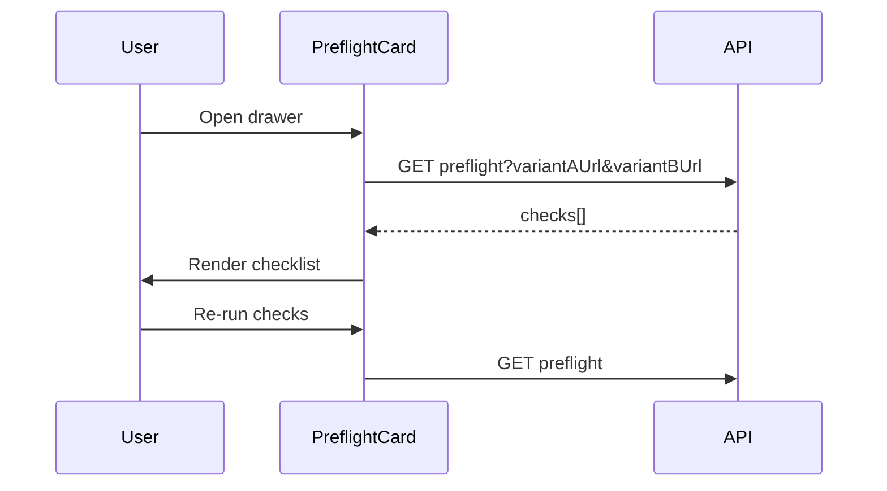

# Task 04: Dashboard Preflight Card

## Location

- **Package:** `packages/dashboard`
- **Files to create/modify:**
  - `src/components/PreflightCard.jsx` — **create**
  - `src/components/ExperimentDrawer.jsx` — embed preflight section
  - `src/App.jsx` — pass variant URLs if managed in parent state
  - `src/styles.css` — checklist icon styles (pass/warn/fail)

## Dependencies

- Task 03 (GET preflight)
- Task 05 (api.js)
- Optional: URL fields shared with FR-02 ConfigRecommendationPanel

## What to build

### Component: `PreflightCard.jsx`

**Props:**

```javascript
{
  experimentId: string,
  experiment: object,
  variantAUrl: string,
  variantBUrl: string,
  setError: (msg: string) => void,
}
```

**Local state:**

- `result` — PreflightResult | null
- `loading` boolean
- `lastRunAt` — display copy of evaluatedAt

### UI layout (ASCII wireframe)

```
┌─ Pre-flight checks ──────────────────────────────┐
│ Ready: ✗ Not ready (4/8 passed)    [Re-run checks]│
│ Last run: 2 minutes ago                          │
│                                                  │
│ ✓ C1b  Variant URLs provided                     │
│ ✓ C1   Variant A URL reachable — HTTP 200 120ms  │
│ ✗ C2   Variant B URL unreachable — connection …  │
│ ✓ C3   Events exist — 10,000 events              │
│ ⚠ C4   Exposures — variant B has 0 page_views   │
│ ✓ C5   Traffic split — 50%                       │
│ ✗ C6   Hypothesis is empty                       │
│ ⚠ C7   Sample size — 120 exposures per variant   │
│ ✓ C8   Overlap — single experiment in system     │
│                                                  │
│ Failed checks:                                   │
│ • C2: Check variant B URL or start storefront    │
│ • C6: Generate or enter a hypothesis             │
└──────────────────────────────────────────────────┘
```

### Status icons

| status | Icon | CSS class |
|--------|------|-----------|
| pass | ✓ | `preflight-pass` |
| warn | ⚠ | `preflight-warn` |
| fail | ✗ | `preflight-fail` |

### Interactions

1. **Auto-run on drawer open** (optional) — call preflight once when drawer opens.
2. **Re-run checks** — manual refresh; show spinner on button.
3. **Remediation hints** — map check IDs to static hint strings:

```javascript
const HINTS = {
  C2: 'Verify the storefront is running (localhost:5173) and the URL includes ?variant=B',
  C3: 'Simulate traffic or run demo seed to collect events',
  C6: 'Use the Hypothesis panel above to generate or enter a hypothesis',
  C7: 'Increase simulated users or wait for more traffic before analyzing',
};
```

4. Pass `variantAUrl` / `variantBUrl` from drawer state (shared with FR-02 URL inputs if consolidated).

### Ready badge

- `ready === true` → green "Ready to analyze"
- `ready === false` → red "Not ready" + score

Do not block Analyze button in v1.5 (advisory only) — optional tooltip "Preflight checks failing".

## Design spec

### Component hierarchy

```mermaid
flowchart TD
  ExperimentDrawer --> PreflightCard
  PreflightCard --> getPreflight
  PreflightCard --> HINTS map
```

### Data flow



## Done when

- [ ] PreflightCard renders all checks in server order
- [ ] Pass/warn/fail visually distinct
- [ ] Re-run button works with loading state
- [ ] Failed checks show remediation hints
- [ ] Ready badge reflects `result.ready`
- [ ] URL query params passed from drawer URL fields
- [ ] No crash when preflight API returns 503
