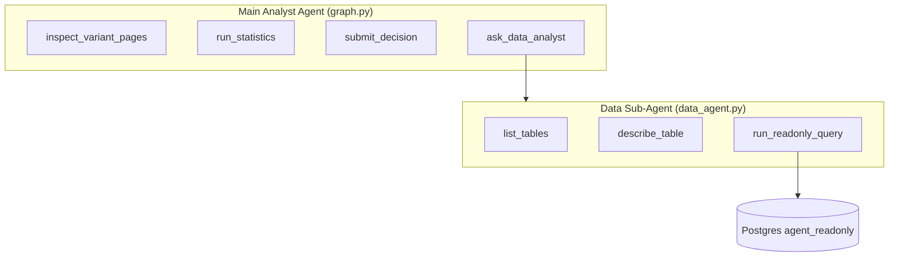

# FR-04: Versatile SQL Data Sub-Agent — Implementation Spec

| Field | Value |
|-------|--------|
| Requirement | [FR-04-sql-data-agent.md](requirements.md) |
| Status | Spec ready |
| Priority | P0 |
| Depends on | FR-05 (tool budget, error wrapping) |
| Blocks | FR-02 (optional integration) |

## Problem

The main analyst agent today attaches `SQLDatabaseToolkit` directly with `include_tables=["universal_events", "experiments"]` and a system prompt full of hardcoded table names, column lists, example SQL, and event names (`page_view`, `checkout_completed`). This biases the agent to the hackathon ecom schema and prevents generic reuse.

## Solution

Introduce a **dedicated data sub-agent** exposed to the main agent as a single tool: `ask_data_analyst(question)`. The sub-agent discovers schema at runtime via `list_tables` / `describe_table`, executes read-only SQL through `run_readonly_query`, and returns structured JSON answers.

## Architecture



## Scope

### In scope

- Remove `SQLDatabaseToolkit` from main agent tool list
- New module `app/agent/data_agent.py` with sub-agent + three low-level tools
- App-layer SQL validation (SELECT-only, keyword blocklist, auto-LIMIT)
- Main prompt cleanup — no table/column/event-name hints
- Optional DB migration for `GRANT SELECT ON ALL TABLES IN SCHEMA public`

### Out of scope

- Write/DDL/DML queries
- Cross-database federation
- User-supplied connection strings
- Caching `list_tables` / `describe_table` (open question — defer unless perf requires)

## Task index

| # | Task | File |
|---|------|------|
| 1 | DB permissions migration | [tasks/01-db-permissions.md](./tasks/01-db-permissions.md) |
| 2 | Read-only SQL tools | [tasks/02-readonly-sql-tools.md](./tasks/02-readonly-sql-tools.md) |
| 3 | Data sub-agent + prompt | [tasks/03-data-sub-agent.md](./tasks/03-data-sub-agent.md) |
| 4 | `ask_data_analyst` main tool | [tasks/04-ask-data-analyst-tool.md](./tasks/04-ask-data-analyst-tool.md) |
| 5 | Main agent prompt cleanup | [tasks/05-main-prompt-cleanup.md](./tasks/05-main-prompt-cleanup.md) |
| 6 | Wire into `build_agent` | [tasks/06-integrate-build-agent.md](./tasks/06-integrate-build-agent.md) |

## Key files

| Path | Role |
|------|------|
| `packages/copilot-backend/app/agent/data_agent.py` | **New** — sub-agent, tools, `ask_data_analyst` |
| `packages/copilot-backend/app/agent/graph.py` | Remove SQL toolkit; add `ask_data_analyst`; prompt cleanup |
| `packages/ecom-backend/migrations/002_agent_readonly_grants.sql` | **New** — broad SELECT grants |
| `packages/copilot-backend/app/config.py` | `DATA_AGENT_MAX_TOOL_CALLS` (default 6) |

## API / tool contracts

### `ask_data_analyst(question: str) -> str`

Returns JSON string:

```json
{
  "answer": "Variant B has 900 conversions vs 790 for A on checkout_completed.",
  "sql_used": ["SELECT variant_id, COUNT(*) ..."],
  "tables_used": ["universal_events"],
  "error": null
}
```

On failure:

```json
{
  "answer": "",
  "sql_used": [],
  "tables_used": [],
  "error": "Query timed out after 5s"
}
```

## Acceptance criteria (from FR)

- [ ] Main agent no longer has direct `SQLDatabaseToolkit` tools attached
- [ ] Sub-agent can answer "what event names exist?" without hardcoded schema in main prompt
- [ ] `run_readonly_query("DELETE …")` rejected at app layer
- [ ] Adding a new table to DB (with GRANT) works without code change to table list

## Testing

See [tests/test-plan.md](./tests/test-plan.md) — minimum 10 cases covering happy path, validation, timeout, empty results, and dynamic schema discovery.
