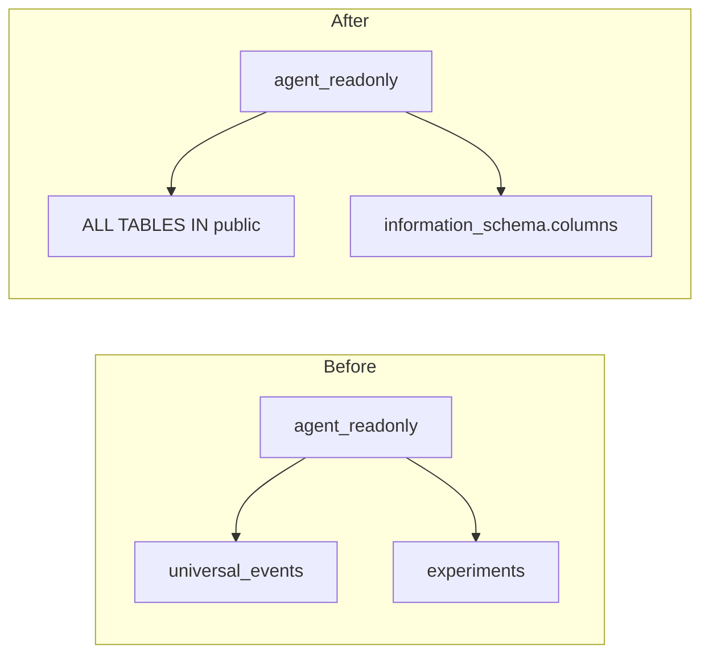

# Task 01: DB Permissions for Dynamic Schema Discovery

## Location

| Action | Path |
|--------|------|
| Create | `packages/ecom-backend/migrations/002_agent_readonly_grants.sql` |
| Verify | `packages/ecom-backend/migrations/001_init.sql` (existing `agent_readonly` role) |
| Run via | `packages/ecom-backend/app/main.py` or existing migration runner |

## Dependencies

- None (can run in parallel with tool implementation)
- FR-05 not required for this task

## What to build

Add a migration that grants `agent_readonly` SELECT on **all current and future** tables in `public`, so `list_tables` can discover any table without code changes.

Today `001_init.sql` may grant SELECT only on specific tables. The data sub-agent must see every table the role is allowed to read.

### Migration SQL

```sql
-- 002_agent_readonly_grants.sql
GRANT SELECT ON ALL TABLES IN SCHEMA public TO agent_readonly;
ALTER DEFAULT PRIVILEGES IN SCHEMA public
  GRANT SELECT ON TABLES TO agent_readonly;
```

Ensure `information_schema` remains readable (default for authenticated roles in Postgres).

## Design spec

### Before / after permissions



### Verification query (run as admin after migration)

```sql
SELECT table_name, privilege_type
FROM information_schema.role_table_grants
WHERE grantee = 'agent_readonly'
  AND table_schema = 'public'
ORDER BY table_name;
```

Expected: `SELECT` on `universal_events`, `experiments`, and any future tables.

## Done when

- [ ] `002_agent_readonly_grants.sql` exists and is picked up by ecom-backend migration runner
- [ ] Fresh `docker compose up` applies migration without error
- [ ] `agent_readonly` can `SELECT` from a newly created test table after `GRANT` / default privileges
- [ ] Existing 5s `statement_timeout` on `agent_readonly` unchanged (see `001_init.sql`)
- [ ] No write grants added to `agent_readonly`
