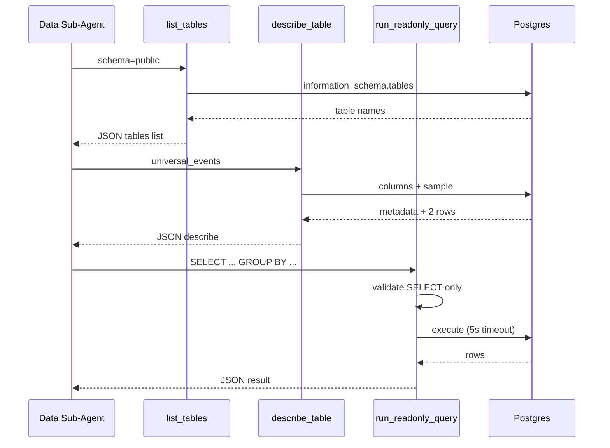

# Task 02: Read-Only SQL Tools (`list_tables`, `describe_table`, `run_readonly_query`)

## Location

| Action | Path |
|--------|------|
| Create | `packages/copilot-backend/app/agent/data_agent.py` |
| Create | `packages/copilot-backend/app/agent/sql_tools.py` (optional split — keep in `data_agent.py` if small) |
| Use | `packages/copilot-backend/app/config.py` → `AGENT_DATABASE_URL` |
| Use | `packages/copilot-backend/app/db.py` or direct `psycopg` connection for agent role |

## Dependencies

- Task 01 (permissions) recommended before integration testing
- Uses same connection string as current `_build_sql_db()` in `graph.py`

## What to build

Three LangChain `@tool` functions used **only** by the data sub-agent (not exposed to main agent).

### `list_tables(schema: str = "public") -> str`

- Query tables visible to `agent_readonly` in the given schema
- Suggested SQL: `SELECT table_name FROM information_schema.tables WHERE table_schema = %s AND table_type = 'BASE TABLE' ORDER BY table_name`
- Return JSON: `{ "schema": "public", "tables": ["experiments", "universal_events"] }`

### `describe_table(table_name: str, schema: str = "public") -> str`

- Columns from `information_schema.columns` (name, data_type, is_nullable)
- Row count estimate: `SELECT reltuples::bigint FROM pg_class WHERE relname = %s` or `COUNT(*)` capped at statement timeout
- Two sample rows: `SELECT * FROM {schema}.{table} LIMIT 2` (use identifier quoting / allowlist from `list_tables` output)
- Return JSON:

```json
{
  "table": "universal_events",
  "columns": [
    { "name": "experiment_id", "type": "text", "nullable": false }
  ],
  "row_count_estimate": 42000,
  "sample_rows": [ { "...": "..." }, { "...": "..." } ]
}
```

### `run_readonly_query(sql: str) -> str`

**Validation (app layer, before execution):**

1. Strip whitespace; must start with `SELECT` (case-insensitive)
2. Reject if contains (case-insensitive): `INSERT`, `UPDATE`, `DELETE`, `DROP`, `ALTER`, `CREATE`, `TRUNCATE`, `GRANT`
3. Append ` LIMIT 500` if no `LIMIT` clause detected (simple regex or sqlparse)
4. Execute via `AGENT_DATABASE_URL` with existing 5s statement timeout

**Success response:**

```json
{
  "columns": ["variant_id", "exposures", "conversions"],
  "rows": [["A", 5000, 790], ["B", 5000, 900]],
  "rowCount": 2,
  "sql": "SELECT ... LIMIT 500"
}
```

**Error response:**

```json
{
  "error": "syntax error at or near ...",
  "sql": "SELECT ..."
}
```

## Design spec

### Tool call flow



### Validation wireframe (reject path)

```
┌─────────────────────────────────────────┐
│ run_readonly_query("DELETE FROM ...") │
├─────────────────────────────────────────┤
│ ✗ Not SELECT                            │
│ ✗ Blocked keyword: DELETE               │
│ → return { error, sql } — no DB call    │
└─────────────────────────────────────────┘
```

## Done when

- [ ] All three tools implemented and unit-testable in isolation
- [ ] `DELETE`, `INSERT`, `UPDATE`, `DROP` rejected without hitting Postgres
- [ ] Queries without `LIMIT` get `LIMIT 500` appended
- [ ] Timeout errors return `{ error: "..." }` not uncaught exception
- [ ] `describe_table` rejects unknown table names not in `list_tables` result (SQL injection guard)
- [ ] Tools are **not** registered on main agent — only passed to sub-agent
