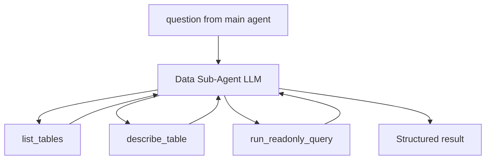

# Task 03: Data Sub-Agent + System Prompt

## Location

| Action | Path |
|--------|------|
| Implement | `packages/copilot-backend/app/agent/data_agent.py` |
| Config | `packages/copilot-backend/app/config.py` — add `DATA_AGENT_MAX_TOOL_CALLS = int(os.getenv("DATA_AGENT_MAX_TOOL_CALLS", "6"))` |

## Dependencies

- Task 02 (readonly SQL tools)
- FR-05 Task 02 (`ToolCallBudget`) — wrap sub-agent tools with nested budget counter

## What to build

An internal LangGraph `create_react_agent` (or single-turn tool loop) that:

1. Receives a natural-language **question** from the main agent (includes experiment id and any context)
2. Uses only `[list_tables, describe_table, run_readonly_query]`
3. Returns a structured answer consumed by `ask_data_analyst`

### Sub-agent system prompt (constraints)

```
You are a read-only data analyst. Answer questions by discovering schema at runtime.

Rules:
- ALWAYS call list_tables, then describe_table on relevant tables before writing SQL for unknown schemas.
- Scope queries using ONLY identifiers provided in the question (e.g. experiment_id). Never assume table or column names.
- NEVER hardcode event names (page_view, checkout_completed, etc.).
- Prefer aggregates; never return more than 20 raw rows of potentially sensitive data in your final answer text.
- If a query fails, try describe_table and rewrite once.
- Return a concise natural-language answer plus the SQL you ran.
```

**Explicit non-goals in prompt:** no mention of `universal_events`, `experiments`, or ecom-specific schema.

### Invocation

```python
async def run_data_agent(question: str, budget: ToolCallBudget | None = None) -> dict:
    """Returns { answer, sql_used: list[str], tables_used: list[str], error: str | None }"""
```

- Max **6** tool calls per sub-agent invocation (`DATA_AGENT_MAX_TOOL_CALLS`)
- On budget exceed: return `{ error: "Data sub-agent tool limit reached", ... }`

## Design spec

### Sub-agent internal architecture



### Example question → answer

**Input question (from main agent):**

> For experiment `exp_1`, what distinct event names exist in the telemetry data, and what are exposure and conversion counts per variant if we measure success by the most checkout-like event?

**Output:**

```json
{
  "answer": "Events: page_view, add_to_cart, checkout_started, checkout_completed. Per variant on checkout_completed/page_view: A 790/5000, B 900/5000.",
  "sql_used": [
    "SELECT DISTINCT event_name FROM ... WHERE experiment_id = 'exp_1'",
    "SELECT variant_id, COUNT(*) FILTER ... GROUP BY variant_id"
  ],
  "tables_used": ["universal_events"],
  "error": null
}
```

### Prompt audit checklist

| Must NOT appear in sub-agent prompt | Must appear |
|-------------------------------------|-------------|
| `universal_events(...)` column list | `list_tables` before unknown tables |
| `page_view`, `checkout_completed` | experiment id from question only |
| Example FILTER SQL template | 20-row PII cap in answer |

## Done when

- [ ] `run_data_agent()` callable independently of main agent
- [ ] Sub-agent discovers schema without hardcoded table names in prompt
- [ ] Tool call budget enforced at 6 (configurable via env)
- [ ] Returns `sql_used` and `tables_used` arrays for main agent / decision capture
- [ ] Empty query result → answer with `rowCount: 0` caveat, not exception
- [ ] Invalid SQL → one retry path documented in prompt behavior
