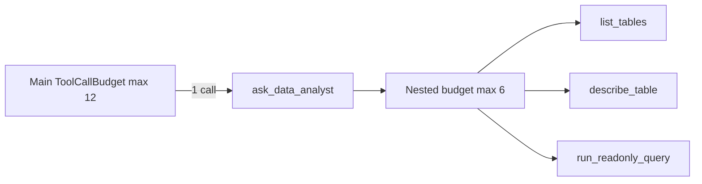

# Task 04: `ask_data_analyst` Main-Agent Tool

## Location

| Action | Path |
|--------|------|
| Implement | `packages/copilot-backend/app/agent/data_agent.py` — export `make_ask_data_analyst_tool()` |
| Register | `packages/copilot-backend/app/agent/graph.py` — `build_agent()` tool list |

## Dependencies

- Task 03 (data sub-agent)
- FR-05 Task 03 (tool budget wraps this tool; nested sub-agent calls count toward budget or separate nested counter per FR-05 spec)

## What to build

A single `@tool` exposed to the **main** analyst agent:

```python
@tool
async def ask_data_analyst(question: str) -> str:
    """Ask the read-only data analyst to discover schema and run SQL.
    Include experiment id and what aggregates you need. Returns JSON with
    answer, sql_used, tables_used."""
```

### Behavior

1. Accept free-text question from main agent LLM
2. Spawn / invoke data sub-agent (`run_data_agent`)
3. Serialize result as JSON **string** (LangChain tool convention)
4. Propagate sub-agent errors in JSON, not raised exceptions (so main agent can explain to PM)

### Nested budget interaction (FR-05)

Per FR-04 requirement: sub-agent has max 6 internal tool calls **inside** FR-05 global budget.



Option A (recommended): `ask_data_analyst` increments main budget by 1; sub-agent has its own isolated counter of 6.

Option B: Each sub-agent tool call increments main budget (stricter). Document choice in implementation.

## Design spec

### Tool docstring (for LLM)

```
Use ask_data_analyst whenever you need to:
- Discover what tables or event names exist for this experiment
- Fetch per-variant exposure and conversion counts
- Run any read-only aggregate query

Pass a complete question including experiment_id. Do NOT write SQL yourself.
```

### Return shape (always JSON string)

**Success:**

```json
{
  "answer": "Variant B has 900 conversions vs 790 for A on checkout_completed.",
  "sql_used": ["SELECT variant_id, COUNT(*) FILTER (WHERE event_name = 'page_view') ..."],
  "tables_used": ["universal_events"],
  "error": null
}
```

**Sub-agent failure:**

```json
{
  "answer": "",
  "sql_used": ["SELECT ..."],
  "tables_used": ["universal_events"],
  "error": "Query timed out after 5 seconds"
}
```

### Main agent usage in workflow

Replace old steps 3–4 (DISTINCT event_name + aggregation SQL) with:

```
3. DATA: Call ask_data_analyst with a question to list available events and get per-variant exposure/conversion counts for your inferred metric.
4. Use the returned sql_used when calling submit_decision.
```

## Done when

- [ ] `ask_data_analyst` registered in main agent tool list
- [ ] Returns valid JSON string on success and on sub-agent error
- [ ] Main agent never receives raw SQL toolkit tools
- [ ] `sql_used` from response can be forwarded to `submit_decision(sql_used=...)`
- [ ] Tool failures do not crash the graph — main agent gets error JSON to narrate
