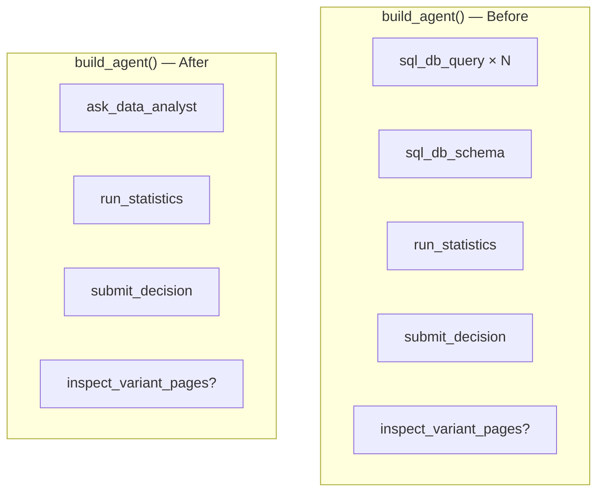

# Task 06: Integrate into `build_agent` — Remove SQLDatabaseToolkit

## Location

| Action | Path |
|--------|------|
| Edit | `packages/copilot-backend/app/agent/graph.py` |
| Remove | `_build_sql_db()`, `_sql_tools` global cache, `SQLDatabaseToolkit` imports |
| Add | Import `make_ask_data_analyst_tool` from `data_agent.py` |

## Dependencies

- Tasks 02–05 complete
- FR-05 Task 03 (`wrap_tools`) — main agent tools wrapped with budget

## What to build

Refactor `build_agent(exp)` so the main agent tool list becomes:

```python
tools = [
    run_statistics,
    make_decision_tool(capture),
    make_ask_data_analyst_tool(),  # replaces entire SQLDatabaseToolkit
]
if has_browser:
    tools.append(make_inspect_tool())

# FR-05: tools = wrap_tools(tools, budget)
```

### Deletions

| Symbol | Reason |
|--------|--------|
| `_build_sql_db()` | Hardcoded `include_tables` — anti-pattern for FR-04 |
| `_sql_tools` global | No longer caching SQL toolkit |
| `from langchain_community.agent_toolkits.sql.toolkit import SQLDatabaseToolkit` | Replaced by data sub-agent |
| `from langchain_community.utilities import SQLDatabase` | Same |

### `submit_decision` integration

Main agent should pass `sql_used` from `ask_data_analyst` JSON (join `sql_used` array if multiple).

### `chat_turn` / `analyze_experiment`

No signature change required here (FR-05 handles guardrails separately), but verify decision payload still includes `sql_used` string after integration.

## Design spec

### Tool list comparison



### Startup / warm-up

`main.py` lifespan currently may warm Playwright — no SQL toolkit warm-up needed. Remove any SQL-related startup logs if present.

### Rollback plan

If sub-agent fails in production, feature flag optional:

```python
USE_DATA_SUB_AGENT = os.getenv("USE_DATA_SUB_AGENT", "true").lower() == "true"
```

Not required for hackathon — document as optional in spec only.

## Done when

- [ ] `build_agent()` does not import or use `SQLDatabaseToolkit`
- [ ] Main agent has exactly one data access tool: `ask_data_analyst`
- [ ] End-to-end `/analyze` still produces decision with `inferred_metric` and `sql_used`
- [ ] `docker compose up` + `curl POST .../analyze` succeeds on seeded `exp_1`
- [ ] Adding a new granted table is queryable without code change (manual verification)
- [ ] No regression: `run_statistics` and `submit_decision` still on main agent
