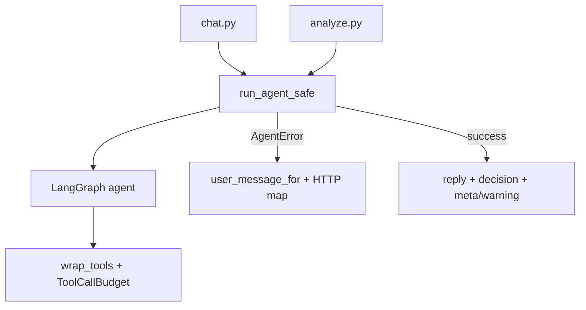

# FR-05: Agent Guardrails & Graceful Error Handling — Implementation Spec

| Field | Value |
|-------|--------|
| Requirement | [FR-05-agent-guardrails-errors.md](requirements.md) |
| Status | Spec ready |
| Priority | P0 |
| Depends on | — |
| Blocks | FR-04, FR-06 |

## Problem

Today the copilot agent has prompt-only scope guardrails and DB-level SQL read-only enforcement, but:

- No tool-call budget (runaway cost/latency possible)
- `recursion_limit=25` hardcoded in `graph.py`
- Routes raise raw 500 with `str(err)` — stack traces leak to dashboard
- No structured `warning` / `error` contract for partial success

## Solution

Central **`app/agent/guardrails.py`** module wrapping all agent invocations. Enforces budgets, catches failures, maps to user-safe messages and HTTP status codes per [00-engineering-standards.md](../00-engineering-standards.md).

## Architecture



## Task index

| # | Task | File |
|---|------|------|
| 1 | Config env vars | [tasks/01-config-env-vars.md](./tasks/01-config-env-vars.md) |
| 2 | `guardrails.py` core | [tasks/02-guardrails-module.md](./tasks/02-guardrails-module.md) |
| 3 | Tool budget wrapping | [tasks/03-tool-budget-wrapping.md](./tasks/03-tool-budget-wrapping.md) |
| 4 | `run_agent_safe` integration | [tasks/04-run-agent-safe.md](./tasks/04-run-agent-safe.md) |
| 5 | Route error wrapping | [tasks/05-route-error-wrapping.md](./tasks/05-route-error-wrapping.md) |
| 6 | Dashboard warnings UI | [tasks/06-dashboard-warnings.md](./tasks/06-dashboard-warnings.md) |

## Response contracts

### Chat success (200)

```json
{
  "reply": "Variant B is ahead…",
  "decision": { "decision": "Scale", "...": "..." },
  "meta": { "toolCallsUsed": 8 }
}
```

### Chat soft failure (200)

```json
{
  "reply": "I couldn't finish the full analysis…",
  "decision": null,
  "warning": {
    "code": "AGENT_TOOL_LIMIT",
    "message": "This analysis needed too many steps…",
    "retryable": true
  }
}
```

### Analyze hard failure

```json
HTTP 502
{
  "error": {
    "code": "AGENT_NO_DECISION",
    "message": "I couldn't produce a final recommendation…",
    "retryable": true
  }
}
```

## Acceptance criteria

- [ ] Agent stopped after 12 tool calls with user message, not 500 stack trace
- [ ] Recursion limit produces `AGENT_RECURSION_LIMIT`
- [ ] `analyze` without `submit_decision` returns `AGENT_NO_DECISION`, not generic 500
- [ ] Logs include `experiment_id` and tool call count

## Testing

See [tests/test-plan.md](./tests/test-plan.md).
