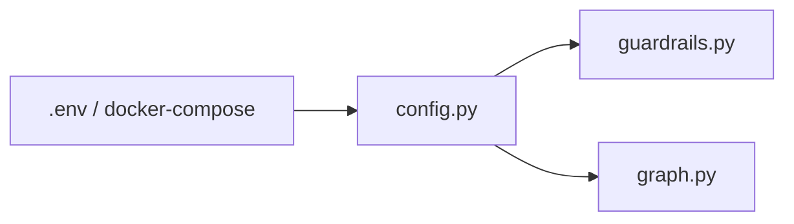

# Task 01: Agent Guardrail Configuration

## Location

| Action | Path |
|--------|------|
| Edit | `packages/copilot-backend/app/config.py` |
| Document | `packages/copilot-backend/.env.example` (if exists; else add vars to README comment in config) |

## Dependencies

- None

## What to build

Add environment-driven limits matching engineering standards:

```python
AGENT_MAX_TOOL_CALLS = int(os.getenv("AGENT_MAX_TOOL_CALLS", "12"))
AGENT_RECURSION_LIMIT = int(os.getenv("AGENT_RECURSION_LIMIT", "25"))
AGENT_LLM_TIMEOUT_SEC = int(os.getenv("AGENT_LLM_TIMEOUT_SEC", "120"))
DATA_AGENT_MAX_TOOL_CALLS = int(os.getenv("DATA_AGENT_MAX_TOOL_CALLS", "6"))  # FR-04 nested budget
```

### Defaults rationale

| Var | Default | Matches |
|-----|---------|---------|
| `AGENT_MAX_TOOL_CALLS` | 12 | 00-engineering-standards.md |
| `AGENT_RECURSION_LIMIT` | 25 | Current hardcoded value in `graph.py` |
| `AGENT_LLM_TIMEOUT_SEC` | 120 | Reasonable chat/analyze ceiling |

## Design spec

### Config flow



### Example `.env` snippet

```
AGENT_MAX_TOOL_CALLS=12
AGENT_RECURSION_LIMIT=25
AGENT_LLM_TIMEOUT_SEC=120
DATA_AGENT_MAX_TOOL_CALLS=6
```

## Done when

- [ ] All four constants exported from `config.py`
- [ ] Defaults match FR-05 and current behavior for recursion limit
- [ ] Values are integers (invalid env falls back or raises clear error at startup)
- [ ] No secrets added to config
