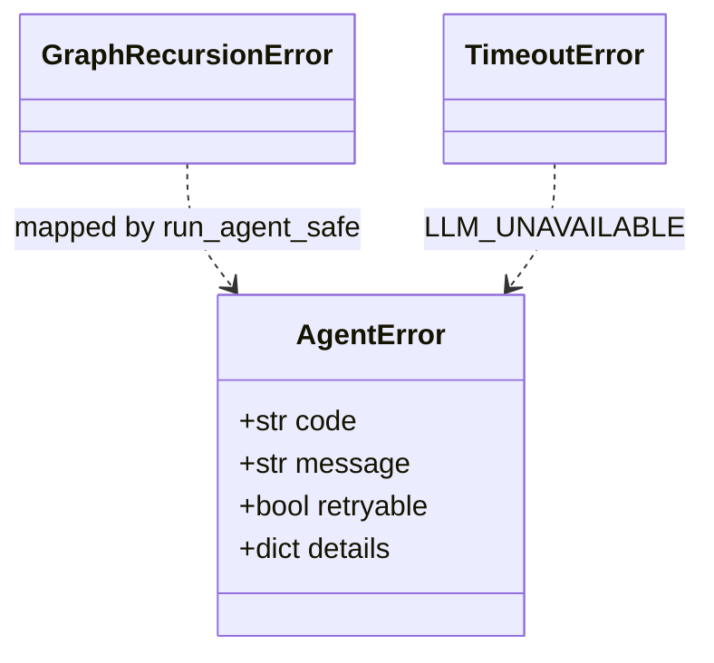

# Task 02: `guardrails.py` Core Module

## Location

| Action | Path |
|--------|------|
| Create | `packages/copilot-backend/app/agent/guardrails.py` |
| Reference | [00-engineering-standards.md](../../00-engineering-standards.md) — error codes + HTTP map |

## Dependencies

- Task 01 (config constants)

## What to build

New module with the following exports:

### `AgentError(Exception)`

```python
class AgentError(Exception):
    def __init__(self, code: str, message: str, retryable: bool = False, details: dict | None = None):
        self.code = code
        self.message = message
        self.retryable = retryable
        self.details = details or {}
```

Known codes:

| code | retryable | HTTP (routes map) |
|------|-----------|-------------------|
| `AGENT_TOOL_LIMIT` | true | 429 |
| `AGENT_RECURSION_LIMIT` | true | 429 |
| `AGENT_NO_DECISION` | true | 502 |
| `LLM_UNAVAILABLE` | true | 503 |
| `INTERNAL_ERROR` | false | 500 |

### `user_message_for(code: str) -> str`

Static map to PM-friendly copy from FR-05:

```python
_MESSAGES = {
    "AGENT_TOOL_LIMIT": "This analysis needed too many steps. Try asking a simpler question, or use Analyze once.",
    "AGENT_RECURSION_LIMIT": "I hit my thinking limit for this turn. Please try again or narrow your question.",
    "AGENT_NO_DECISION": "I couldn't produce a final recommendation. Check pre-flight status and try Analyze again.",
    "LLM_UNAVAILABLE": "Copilot is temporarily unavailable. Live metrics in the drawer are still updating.",
    "INTERNAL_ERROR": "Something unexpected happened. Your experiment data is safe — please retry.",
}
```

### `http_status_for(code: str) -> int`

Per engineering standards table.

### Pydantic schemas (optional in `schemas.py`)

```python
class AgentWarning(BaseModel):
    code: str
    message: str
    retryable: bool = False

class AgentErrorBody(BaseModel):
    code: str
    message: str
    retryable: bool = False
    details: dict = {}
```

## Design spec

### Exception hierarchy



### Error JSON wire format

```json
{
  "error": {
    "code": "AGENT_TOOL_LIMIT",
    "message": "This analysis needed too many steps…",
    "retryable": true,
    "details": {}
  }
}
```

## Done when

- [ ] `guardrails.py` created with `AgentError` and `user_message_for`
- [ ] `http_status_for` covers all codes in engineering standards
- [ ] Unit-testable: `user_message_for("AGENT_TOOL_LIMIT")` returns FR-05 copy
- [ ] No FastAPI imports in guardrails (keep layer pure)
