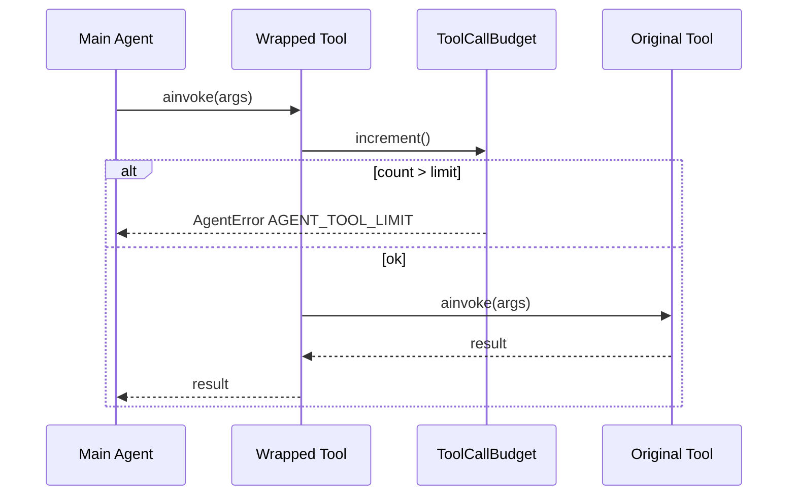

# Task 03: Tool Call Budget Wrapping

## Location

| Action | Path |
|--------|------|
| Implement | `packages/copilot-backend/app/agent/guardrails.py` — `ToolCallBudget`, `wrap_tools` |
| Integrate | `packages/copilot-backend/app/agent/graph.py` — `build_agent()` |

## Dependencies

- Task 02 (`AgentError`)
- Task 01 (`AGENT_MAX_TOOL_CALLS`)

## What to build

### `ToolCallBudget`

```python
class ToolCallBudget:
    def __init__(self, limit: int):
        self.limit = limit
        self.count = 0

    def increment(self) -> None:
        self.count += 1
        if self.count > self.limit:
            raise AgentError(
                code="AGENT_TOOL_LIMIT",
                message=user_message_for("AGENT_TOOL_LIMIT"),
                retryable=True,
                details={"toolCallsUsed": self.count - 1},
            )
```

### `wrap_tools(tools: list, budget: ToolCallBudget) -> list`

Wrap each LangChain `BaseTool` so `ainvoke` / `_run`:

1. Calls `budget.increment()` **before** delegating to original tool
2. Preserves tool name, schema, and async behavior
3. Works for both sync and async tools (`inspect_variant_pages`, `ask_data_analyst`)

### Nested sub-agent (FR-04)

When `ask_data_analyst` runs the data sub-agent:

- **Option A:** Sub-agent gets separate `ToolCallBudget(limit=DATA_AGENT_MAX_TOOL_CALLS)` — does not increment main budget for inner calls
- **Option B:** Inner calls increment main budget — document in code comment

FR-04 spec says nested budget **inside** global budget — implement Option A unless team chooses B.

## Design spec

### Budget counter flow



### Dashboard-facing meta

After successful turn, include in response:

```json
"meta": { "toolCallsUsed": 8 }
```

Source: `budget.count` at end of `run_agent_safe`.

## Done when

- [ ] Every main-agent tool invocation increments budget
- [ ] Exceeding 12 calls raises `AgentError(code="AGENT_TOOL_LIMIT")`
- [ ] Wrapped tools behave identically to unwrapped for happy path
- [ ] `build_agent()` receives wrapped tool list
- [ ] Tool count logged at INFO with experiment_id
