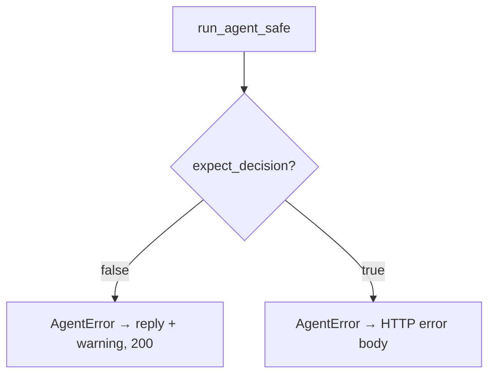

# Task 04: `run_agent_safe` — Graph Invoke Wrapper

## Location

| Action | Path |
|--------|------|
| Implement | `packages/copilot-backend/app/agent/guardrails.py` — `run_agent_safe` |
| Refactor | `packages/copilot-backend/app/agent/graph.py` — `chat_turn`, `analyze_experiment` delegate here |

## Dependencies

- Tasks 02–03
- Task 01 (`AGENT_RECURSION_LIMIT`, `AGENT_LLM_TIMEOUT_SEC`)

## What to build

### `run_agent_safe(agent, input_messages, config, budget, *, expect_decision: bool = False) -> dict`

Responsibilities:

1. Merge `recursion_limit=AGENT_RECURSION_LIMIT` into LangGraph config
2. Optionally wrap LLM call with timeout (`AGENT_LLM_TIMEOUT_SEC`) via asyncio.wait_for
3. Invoke `agent.ainvoke(...)`
4. Catch and map:
   - `GraphRecursionError` → `AgentError(AGENT_RECURSION_LIMIT, retryable=True)`
   - LLM/network timeout → `AgentError(LLM_UNAVAILABLE, retryable=True)`
   - `AgentError` — re-raise
   - Other `Exception` → log at ERROR with correlation id → `AgentError(INTERNAL_ERROR, retryable=False)`

5. Return normalized dict:

```python
{
    "reply": str,           # last message content
    "decision": dict | None,
    "tool_calls_used": int,
    "error": AgentError | None,  # for route layer
}
```

### `expect_decision=True` (analyze path)

If `capture["decision"]` is None after invoke → raise `AgentError(AGENT_NO_DECISION)`.

Replace current:

```python
if capture["decision"] is None:
    raise RuntimeError("agent did not submit a decision")
```

## Design spec

### Chat vs analyze behavior



| Mode | Tool limit hit | No decision |
|------|----------------|-------------|
| Chat | 200 + `warning` | 200 + `warning` AGENT_NO_DECISION optional |
| Analyze | 429/502 per code | 502 AGENT_NO_DECISION |

### Logging

```
INFO  experiment_id=exp_1 tool_calls=8 verdict=Scale
WARN  experiment_id=exp_1 code=AGENT_TOOL_LIMIT tool_calls=12
ERROR experiment_id=exp_1 correlation_id=uuid exception=...
```

Never log API keys or full stack to client.

## Done when

- [ ] `chat_turn` uses `run_agent_safe(expect_decision=False)`
- [ ] `analyze_experiment` uses `run_agent_safe(expect_decision=True)`
- [ ] Hardcoded `recursion_limit: 25` removed from graph.py — sourced from config
- [ ] `GraphRecursionError` never surfaces as raw 500
- [ ] Correlation id in ERROR logs
