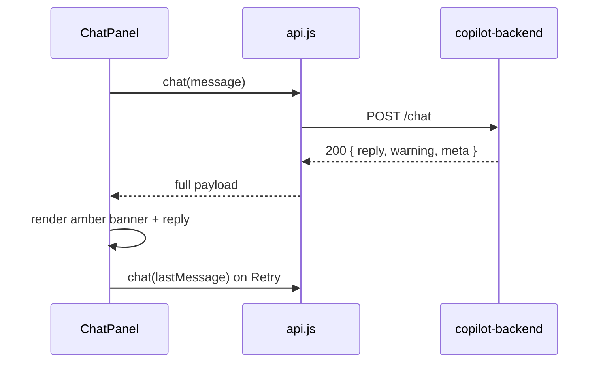

# Task 06: Dashboard Warnings & Error Parsing

## Location

| Action | Path |
|--------|------|
| Edit | `packages/dashboard/src/api.js` |
| Edit | `packages/dashboard/src/components/ChatPanel.jsx` |
| Optional | `packages/dashboard/src/styles.css` — amber warning banner |

## Dependencies

- Task 05 (API returns `warning` and structured `error`)

## What to build

### `api.js`

1. **`parseApiError(body)`** — normalize FastAPI `detail` string vs `{ error: {...} }` object
2. **`chat()`** — return full response including `warning`, `meta`; do not throw on 200 with warning
3. **`analyze()`** — parse `error.code`, `error.message`, `error.retryable` on non-OK

```javascript
export function parseAgentError(body) {
  if (body?.error?.code) return body.error;
  if (typeof body?.detail === 'object' && body.detail?.error) return body.detail.error;
  return { code: 'INTERNAL_ERROR', message: body?.detail || 'Request failed', retryable: false };
}
```

### `ChatPanel.jsx`

1. State: `warning` — `{ code, message, retryable } | null`
2. On chat response: if `res.warning`, set warning banner (amber)
3. **Retry button** when `retryable === true` — re-sends last user message
4. On hard error (non-200): show `parseAgentError` message, not raw stack
5. Optional: show `meta.toolCallsUsed` in dev footer

### UI wireframe

```
┌──────────────────────────────────────────────────┐
│ ⚠ AGENT_TOOL_LIMIT                               │
│ This analysis needed too many steps. Try asking  │
│ a simpler question, or use Analyze once.         │
│                                      [ Retry ]   │
├──────────────────────────────────────────────────┤
│ User: Compare variants and recommend             │
│ Copilot: I couldn't finish the full analysis…    │
└──────────────────────────────────────────────────┘
```

CSS class suggestion: `.chat-warning-banner` — amber background, dismissible.

## Design spec

### Client flow



### Analyze button elsewhere

Ensure callers of `analyze()` in `App.jsx` or similar show friendly error from `parseAgentError`, not `Something went wrong: [object Object]`.

## Done when

- [ ] Chat 200 with `warning` renders banner; conversation still shows `reply`
- [ ] Retry re-invokes chat with same last user message when `retryable`
- [ ] Analyze failure shows PM-friendly message from `error.message`
- [ ] No Python tracebacks visible in UI
- [ ] Existing happy-path chat/decision flow unchanged
