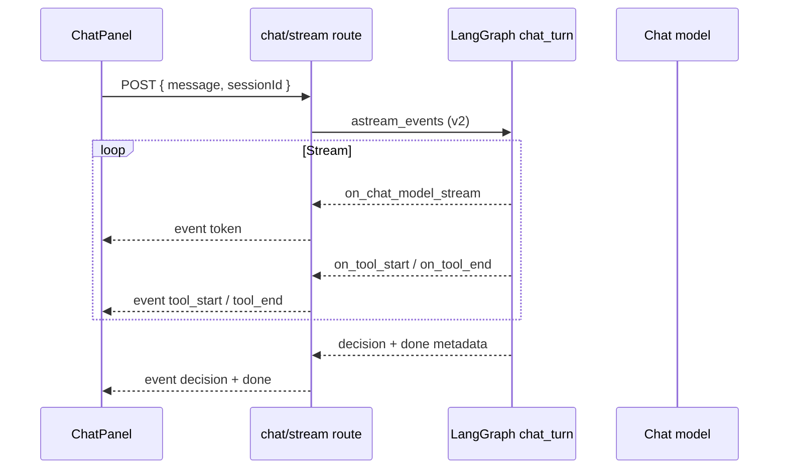

# FR-06: Streaming Chat — Spec Index

| Field | Value |
|-------|--------|
| Requirement | [FR-06-streaming-chat.md](requirements.md) |
| Status | Spec ready |
| Priority | P1 |
| Depends on | [FR-05](../FR-05-agent-guardrails-errors/requirements.md) (structured `AgentError`, timeout env) |
| Blocks | — |

## Problem

Long chat analyses (browser inspection + SQL + statistics) leave the PM staring at a static typing indicator for 30–90 seconds. Non-streaming `/chat` returns only when the full turn completes, hiding progress and inflating perceived latency.

## Solution

Add `POST /experiments/{id}/chat/stream` as an SSE endpoint that emits LLM tokens and tool lifecycle events in real time. Keep existing `POST /chat` unchanged as fallback. Update `ChatPanel` to consume the stream and render incremental assistant text plus step indicators.

## Architecture

## API contract

### `POST /experiments/{id}/chat/stream`

| Item | Value |
|------|--------|
| Request body | Same as `/chat`: `{ "message": string, "sessionId": string }` |
| `sessionId` | **Required** — thread key `{experiment_id}:{sessionId}` |
| Response | `text/event-stream` |
| Headers | `Cache-Control: no-cache`, `X-Accel-Buffering: no` (nginx) |

### SSE events

| `event` | `data` (JSON) | When |
|---------|---------------|------|
| `token` | `{ "content": "partial text" }` | LLM chunk |
| `tool_start` | `{ "name", "label" }` | Tool invocation begins |
| `tool_end` | `{ "name", "ok": bool }` | Tool completes |
| `warning` | `{ "code", "message", "retryable" }` | Partial success (FR-05) |
| `decision` | Decision object | Analysis complete |
| `done` | `{ "toolCallsUsed": number }` | Normal terminal |
| `error` | `{ "code", "message", "retryable" }` | Failure terminal |

**Invariant:** every stream ends with exactly one terminal event — `done` or `error`.

## Key files

| Layer | Path |
|-------|------|
| Route | `packages/copilot-backend/app/routes/chat.py` |
| Stream service | `packages/copilot-backend/app/services/chat_stream.py` (new) |
| Tool labels | `packages/copilot-backend/app/agent/stream_labels.py` (new) |
| Agent | `packages/copilot-backend/app/agent/graph.py` |
| API client | `packages/dashboard/src/api.js` |
| UI | `packages/dashboard/src/components/ChatPanel.jsx` |
| Step indicator | `packages/dashboard/src/components/StreamStepIndicator.jsx` (new) |

## Non-goals (v1.5)

- Streaming on `/analyze`
- WebSockets
- Streaming raw tool JSON to the client

## Tasks

| # | Task | File |
|---|------|------|
| 1 | [SSE route + event generator](./tasks/01-sse-route-and-generator.md) | Backend route |
| 2 | [LangGraph astream_events](./tasks/02-agent-astream-events.md) | Agent integration |
| 3 | [Tool label mapping](./tasks/03-stream-labels.md) | Human-readable steps |
| 4 | [ChatPanel stream consumer](./tasks/04-chatpanel-stream-ui.md) | Dashboard UI |
| 5 | [Fallback + disconnect handling](./tasks/05-fallback-and-cancel.md) | Resilience |

## Acceptance criteria (from FR)

- [ ] First token within 5s for typical analysis prompt
- [ ] Tool steps visible before final decision
- [ ] Stream always ends with `done` or `error`
- [ ] Non-streaming `/chat` unchanged

## Test plan

See [tests/test-plan.md](./tests/test-plan.md).
