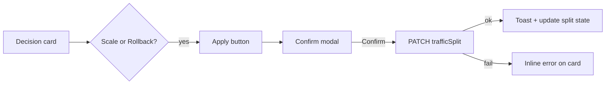

# FR-07: Apply Recommendation — Spec Index

| Field | Value |
|-------|--------|
| Requirement | [FR-07-apply-recommendation.md](requirements.md) |
| Status | Spec ready |
| Priority | P1 |
| Depends on | Existing Decision object, `PATCH /experiments/{id}`, `setTrafficSplit()` in dashboard |
| Blocks | — |

## Problem

The copilot recommends **Scale** or **Rollback**, but the PM must manually open the experiment drawer and drag the traffic slider. The recommendation loop is incomplete — high-friction and poor demo of "AI-guided action."

## Solution

Add a one-click **Apply** action on the Decision card for Scale/Rollback verdicts. Confirm intent in a modal, then call existing `PATCH /experiments/{id}` with `{ trafficSplit: 100 | 0 }`. Sync drawer slider and show success/error feedback.

## Behavior matrix

| Decision | Apply button | PATCH payload | User message |
|----------|--------------|---------------|--------------|
| Scale | Visible, primary | `trafficSplit: 100` | "Variant B is now at 100% traffic." |
| Rollback | Visible, destructive | `trafficSplit: 0` | "Reverted to 100% Variant A." |
| Continue | Hidden or disabled + tooltip | — | — |
| Stop | Hidden or disabled + tooltip | — | — |

## Architecture



## API

**v1.5:** Reuse existing endpoint — no new route required.

```
PATCH /experiments/{id}
{ "trafficSplit": 0 | 100 }
```

Optional future: `POST /experiments/{id}/decisions/{decisionId}/apply` for audit trail.

## Key files

| Layer | Path |
|-------|------|
| Decision UI | `packages/dashboard/src/components/Decision.jsx` |
| Confirm modal | `packages/dashboard/src/components/ApplyDecisionModal.jsx` (new) |
| API client | `packages/dashboard/src/api.js` — `setTrafficSplit` (exists) |
| App state | `packages/dashboard/src/App.jsx` — `split`, `onSplitCommit` |
| Chat integration | `packages/dashboard/src/components/ChatPanel.jsx` — pass callbacks |

## Non-goals

- Auto-apply without confirmation
- Changing variant URLs or deploying code
- Server-side `experiment_actions` audit table (v1.5 — client PATCH only)

## Tasks

| # | Task | File |
|---|------|------|
| 1 | [Apply button on Decision card](./tasks/01-decision-apply-button.md) | Card UI |
| 2 | [Confirmation modal](./tasks/02-confirmation-modal.md) | Safety gate |
| 3 | [PATCH wiring + toast](./tasks/03-patch-and-feedback.md) | API + state sync |
| 4 | [Guardrails + disabled states](./tasks/04-guardrails-disabled-states.md) | Edge cases |

## Acceptance criteria (from FR)

- [ ] Scale decision shows apply button; Continue does not
- [ ] Apply sets traffic to 100 (Scale) or 0 (Rollback) and UI reflects change
- [ ] PATCH failure shows user message, no silent fail

## Test plan

See [tests/test-plan.md](./tests/test-plan.md).
