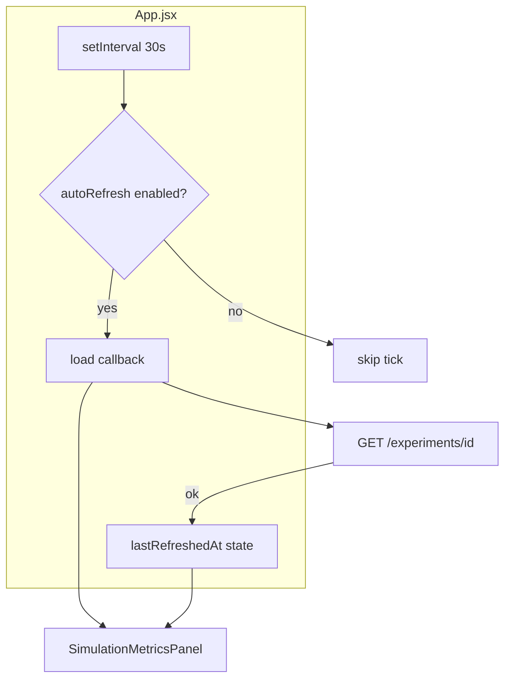

# FR-08: Auto-Refresh Metrics — Spec Index

| Field | Value |
|-------|--------|
| Requirement | [FR-08-auto-refresh-metrics.md](requirements.md) |
| Status | **Partial on main** — extend, do not rebuild |
| Priority | P1 |
| Depends on | Existing `GET /experiments/{id}`, `load()` in App.jsx |
| Blocks | — |

## Problem

Metrics already poll every 30s on main, but the PM cannot tell **when** data was last fetched, cannot pause polling, and a failed poll may wipe the UI via global `setError`. Remaining work is UX polish on top of shipped infrastructure.

## What is already shipped (do not rebuild)

| Item | Location | Status |
|------|----------|--------|
| 30s poll while mounted | `packages/dashboard/src/App.jsx` `setInterval(..., 30_000)` | ✅ |
| Manual refresh ↻ | `SimulationMetricsPanel` | ✅ |
| Event matrix | `GET /experiments/{id}` → `eventMatrix` | ✅ |
| Refresh after decision/simulate | `onDecision`, `onSimulateComplete` → `load()` | ✅ |
| In-flight guard | `refreshing` flag in `load()` | ✅ |

**Do not** add a second poll loop, replace `SimulationMetricsPanel`, or introduce WebSockets.

## Remaining goals

- Show **"Last updated Xs ago"** after each successful fetch
- Optional **pause auto-refresh** toggle (persist in `localStorage`)
- **Soften errors:** keep stale metrics on network failure; amber inline warning
- Subtle **refresh pulse** when poll completes

## Architecture (extend existing)



## Configuration

```javascript
// Already in App.jsx — keep single source
const METRICS_POLL_INTERVAL_MS = 30_000;

// Optional extension
const METRICS_POLL_INTERVAL_MS =
  Number(import.meta.env.VITE_METRICS_POLL_MS) || 30_000;
```

## Key files

| Layer | Path |
|-------|------|
| Poll + load | `packages/dashboard/src/App.jsx` |
| Metrics UI | `packages/dashboard/src/components/SimulationMetricsPanel.jsx` |
| API | `packages/dashboard/src/api.js` — `getExperiment()` (unchanged) |

## Tasks

| # | Task | File |
|---|------|------|
| 1 | [Last updated timestamp](./tasks/01-last-updated-timestamp.md) | Extend App + panel |
| 2 | [Pause toggle + localStorage](./tasks/02-pause-toggle-persistence.md) | Extend interval |
| 3 | [Soft error handling](./tasks/03-soft-error-handling.md) | Extend load() |
| 4 | [Refresh pulse indicator](./tasks/04-refresh-pulse-indicator.md) | Extend panel header |
| 5 | [Optional poll interval env](./tasks/05-poll-interval-env.md) | Extend config |

## Acceptance criteria

- [x] Summary/event matrix updates every 30s with app mounted *(main)*
- [x] Manual refresh works from metrics panel *(main)*
- [ ] "Last updated" visible and updates after each successful poll
- [ ] Optional pause stops interval without breaking manual refresh
- [ ] Failed poll does not crash UI or clear existing metrics

## Test plan

See [tests/test-plan.md](./tests/test-plan.md).
