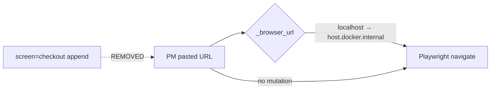

# Task 01: Remove `_deep_link_checkout` Assumption

## Location

| Action | Path |
|--------|------|
| Delete / remove usage | `packages/copilot-backend/app/agent/graph.py` — `_deep_link_checkout()` (~lines 160–168) |
| Edit | `make_inspect_tool()` — `inspect_variant_pages` (~lines 185–186) |

## Dependencies

- None

## What to build

Remove the helper that mutates PM-provided URLs:

```python
# DELETE THIS FUNCTION
def _deep_link_checkout(url: str) -> str:
    query = parts.query + ("&" if parts.query else "") + "screen=checkout"
    ...
```

Update `inspect_variant_pages` to use URLs **verbatim** (only `_browser_url()` for Docker localhost alias remains):

```python
url_a = _browser_url(variant_a_url)
url_b = _browser_url(variant_b_url)
```

### Rationale

FR-12: PM decides which page surface to inspect. Auto-appending `screen=checkout` assumes checkout is always the diff — violates user-input-only rule.

## Design spec

### URL transformation allowed vs forbidden



| Transform | Allowed? |
|-----------|----------|
| `localhost` → `PLAYWRIGHT_LOCALHOST_ALIAS` | Yes (infra) |
| Append `screen=checkout` | **No** |
| Append `?variant=A` | **No** |
| Strip trailing slash | No (verbatim) |

### Before / after inspect call

```
Before: navigate("http://host:5173/?variant=A&screen=checkout")
After:  navigate("http://host:5173/?variant=A")  # exactly what PM sent
```

## Done when

- [ ] `_deep_link_checkout` function removed from codebase
- [ ] No references to `screen=checkout` in copilot-backend
- [ ] `inspect_variant_pages` passes PM URLs unchanged except `_browser_url`
- [ ] Grep `deep_link_checkout` → zero matches
