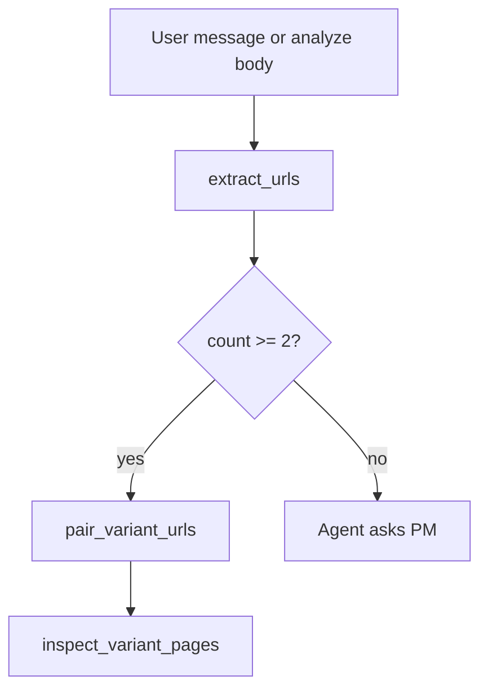

# Task 02: URL Extractor Helper

## Location

| Action | Path |
|--------|------|
| Create | `packages/copilot-backend/app/services/url_extract.py` (or `app/agent/url_extract.py`) |
| Optional use | `packages/copilot-backend/app/agent/graph.py` — inject URLs into analyze one-shot message |

## Dependencies

- None (optional enhancement for `/analyze` and chat preflight)

## What to build

Lightweight helper to pull HTTP(S) URLs from user text — **no hardcoded paths or demo hosts**.

```python
import re
from urllib.parse import urlparse

_URL_RE = re.compile(r"https?://[^\s<>\"']+", re.IGNORECASE)

def extract_urls(text: str) -> list[str]:
    """Return unique URLs in order of appearance."""

def validate_url(url: str) -> bool:
    """scheme in http/https, netloc present."""

def pair_variant_urls(urls: list[str]) -> tuple[str | None, str | None]:
    """If exactly 2+ URLs, return first two distinct. No variant=A inference."""
```

### Non-goals

- Do not assume `variant=A` / `variant=B` query params
- Do not default to `localhost:5173`
- Do not read from `experiments` table

### Optional integration

`analyze_experiment(exp, variant_a_url, variant_b_url)` can prepend a synthetic user message:

```
Variant A URL: {variant_a_url}
Variant B URL: {variant_b_url}
Analyze this experiment now and submit a decision.
```

## Design spec

### Extractor examples

| Input | Output |
|-------|--------|
| `"Compare https://a.example.com and https://b.example.com"` | `["https://a.example.com", "https://b.example.com"]` |
| `"See http://localhost:5173/?variant=A"` | `["http://localhost:5173/?variant=A"]` — no rewrite |
| `"No links here"` | `[]` |

### Flow (optional)



## Done when

- [ ] `extract_urls` unit-tested with mixed text
- [ ] No hardcoded demo URLs in module
- [ ] `validate_url` rejects `javascript:` and missing netloc
- [ ] Helper is pure — no DB access
