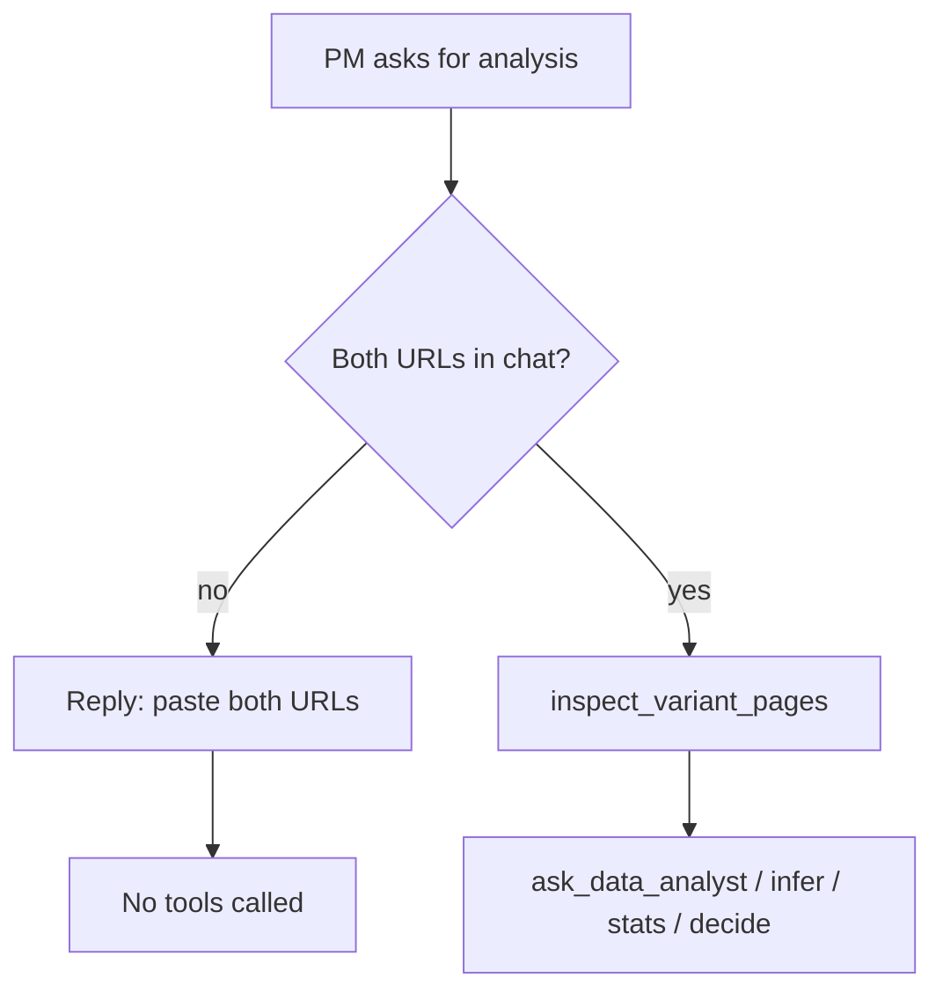

# Task 03: Agent Prompt — URL-First Workflow

## Location

| Action | Path |
|--------|------|
| Edit | `packages/copilot-backend/app/agent/graph.py` — `_system_prompt()` |
| Edit | `make_inspect_tool()` docstring if needed |

## Dependencies

- Task 01 (no deep link)
- Aligns with FR-04 prompt cleanup (coordinate to avoid merge conflicts)

## What to build

Rewrite workflow step 1 and guardrails in `_system_prompt()`:

### Required prompt language

```
1. GET URLS: Extract BOTH variant URLs from the PM's messages in this thread.
   - Do NOT read URLs from experiment config or the database.
   - Do NOT use example or default URLs.
   - If you do NOT have both URLs, ask the PM once to paste both links and STOP.
     Do not call inspect_variant_pages, ask_data_analyst, run_statistics, or
     submit_decision until both URLs are provided in the conversation.
```

### Remove

- Any example URLs (`localhost:5173`, `?variant=A`)
- Implication that URLs are stored on the experiment record
- Instructions to inspect checkout specifically

### `inspect_variant_pages` tool behavior (already partial)

Tool returns early if URLs missing — keep:

```python
if not variant_a_url or not variant_b_url:
    return "Missing a URL. Ask the PM to provide BOTH..."
```

## Design spec

### Agent decision tree



### Chat UX wireframe

```
┌────────────────────────────────────────────┐
│ PM: Analyze the experiment               │
├────────────────────────────────────────────┤
│ Copilot: I need the URLs for both variants │
│ (A and B) before I can inspect the pages   │
│ and run the analysis. Please paste both.   │
│                                            │
│ (no browser spinner / no SQL tools run)    │
└────────────────────────────────────────────┘
```

## Done when

- [ ] Step 1 explicitly says "from PM's messages in this thread"
- [ ] Explicit STOP before tools when URLs missing
- [ ] No example URLs in `_system_prompt`
- [ ] Fresh chat "Analyze now" → agent asks for URLs (manual test)
- [ ] Agent does not call `inspect_variant_pages` without two URLs
