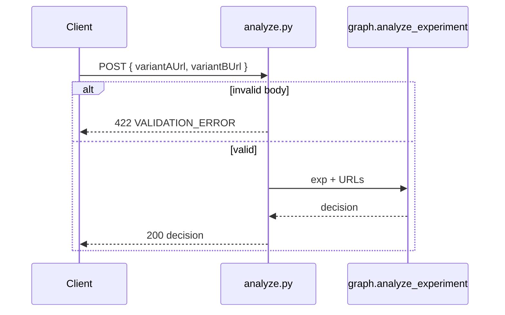

# Task 04: `/analyze` Request Body URLs

## Location

| Action | Path |
|--------|------|
| Edit | `packages/copilot-backend/app/schemas.py` — add `AnalyzeIn` |
| Edit | `packages/copilot-backend/app/routes/analyze.py` |
| Edit | `packages/copilot-backend/app/agent/graph.py` — `analyze_experiment(exp, variant_a_url, variant_b_url)` |

## Dependencies

- Task 02 (optional — URL validation helper)
- FR-05 (structured 422 errors)

## What to build

### Request schema

```python
class AnalyzeIn(BaseModel):
    variantAUrl: str
    variantBUrl: str

    @field_validator("variantAUrl", "variantBUrl")
    @classmethod
    def must_be_http_url(cls, v: str) -> str:
        ...
```

### Route change

```python
@router.post("/experiments/{experiment_id}/analyze")
async def analyze(experiment_id: str, body: AnalyzeIn):
    ...
    decision = await analyze_experiment(
        dict(exp),
        variant_a_url=body.variantAUrl,
        variant_b_url=body.variantBUrl,
    )
```

### Validation failures → 422

```json
{
  "error": {
    "code": "VALIDATION_ERROR",
    "message": "variantAUrl and variantBUrl are required for analysis.",
    "retryable": false,
    "details": { "missing": ["variantBUrl"] }
  }
}
```

Use FastAPI `HTTPException(422, detail={...})` matching engineering standards.

### Do NOT

- Fall back to `exp["variant_a_url"]` from DB
- Start agent without both URLs
- Accept empty strings

### `analyze_experiment` signature

Inject URLs into agent thread as first user message (see Task 02):

```python
async def analyze_experiment(
    exp: dict,
    *,
    variant_a_url: str,
    variant_b_url: str,
) -> dict:
    message = (
        f"Variant A URL: {variant_a_url}\n"
        f"Variant B URL: {variant_b_url}\n"
        "Analyze this experiment now and submit a decision."
    )
```

## Design spec

### API contract

```
POST /experiments/{id}/analyze
Content-Type: application/json

Request:
{
  "variantAUrl": "https://shop.example.com/page-a",
  "variantBUrl": "https://shop.example.com/page-b"
}

Response 200: Decision object (unchanged)

Response 422: missing/invalid URLs — agent NOT invoked
```

### Sequence



## Done when

- [ ] POST without body → 422 (FastAPI validation)
- [ ] POST with one URL missing → 422 with clear message
- [ ] POST with valid URLs → agent runs; no DB URL lookup
- [ ] Agent thread receives both URLs in first message
- [ ] Response time for 422 < 100ms (no LLM call)
