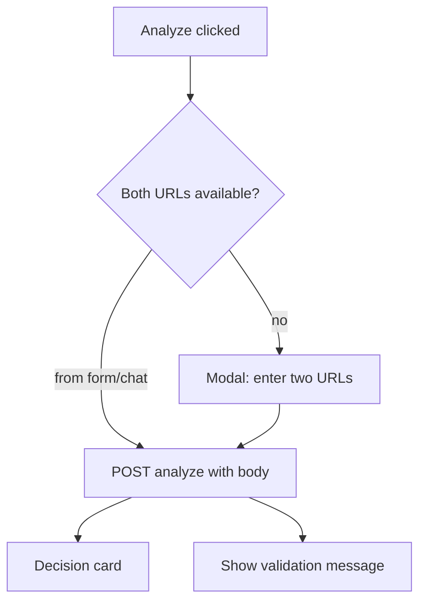

# Task 06: Dashboard — Pass URLs to Analyze

## Location

| Action | Path |
|--------|------|
| Edit | `packages/dashboard/src/api.js` — `analyze()` |
| Edit | `packages/dashboard/src/App.jsx` or component that triggers Analyze |
| Optional | `packages/dashboard/src/components/ExperimentDrawer.jsx` — user-entered URL fields |

## Dependencies

- Task 04 (analyze API requires body)

## What to build

Update client to send URLs with analyze requests. URLs must originate from **user input** (chat context or explicit form fields) — not silently from env defaults alone.

### `api.js`

```javascript
export async function analyze({ variantAUrl, variantBUrl, id = EXPERIMENT_ID }) {
  const res = await fetch(`${API_BASE}/experiments/${id}/analyze`, {
    method: 'POST',
    headers: { 'Content-Type': 'application/json' },
    body: JSON.stringify({ variantAUrl, variantBUrl }),
  });
  if (res.status === 422) {
    const body = await res.json().catch(() => ({}));
    throw new Error(parseAgentError(body).message || 'Both variant URLs are required.');
  }
  ...
}
```

### URL source priority (UI)

1. **Explicit fields** in experiment drawer (PM typed, optional FR-12 UX)
2. **Last chat message** URLs extracted client-side (optional mirror of server helper)
3. **Prompt PM** — if Analyze clicked without URLs, modal: "Paste variant A and B URLs"

Do **not** auto-fill from `experiment.variant_a_url` without user confirmation (optional UX: pre-fill editable fields).

## Design spec

### Analyze button flow



### Modal wireframe

```
┌─────────────────────────────────────┐
│ Analyze experiment                  │
├─────────────────────────────────────┤
│ Variant A URL                       │
│ [ https://________________ ]        │
│ Variant B URL                       │
│ [ https://________________ ]        │
│                                     │
│              [ Cancel ] [ Analyze ] │
└─────────────────────────────────────┘
```

### Updated smoke curl (document in spec)

```bash
curl -s -X POST localhost:3001/experiments/exp_1/analyze \
  -H 'Content-Type: application/json' \
  -d '{"variantAUrl":"http://localhost:5173/?variant=A","variantBUrl":"http://localhost:5173/?variant=B"}'
```

Note: curl example uses demo URLs as **test input**, not hardcoded in agent code.

## Done when

- [ ] Dashboard Analyze sends JSON body with both URLs
- [ ] Missing URLs show user-friendly 422 message, not hung spinner
- [ ] No automatic analyze on page load without URLs
- [ ] `npm run build` passes in dashboard package
- [ ] One-click analyze (FR-10) can build on this contract later
