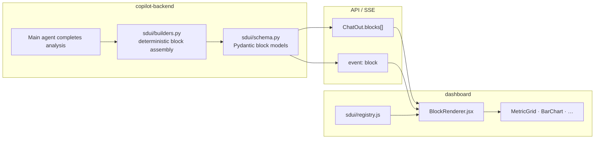

# FR-13: SDUI Chat Widgets — Spec Index

| Field | Value |
|-------|--------|
| Requirement | [FR-13-sdui-chat-widgets.md](requirements.md) |
| Status | Draft |
| Priority | P1 |
| Depends on | FR-06, FR-11 |

## Problem

Today chat renders:
- User bubbles (plain text)
- Assistant `FormattedMessage` (markdown string)
- Separate `Decision` card (hardcoded React, not in message list)

There is no protocol for charts, tables, or inline actions. Every new visual requires a frontend deploy.

## Solution

**Server-Driven UI (SDUI):** backend returns an ordered list of typed **blocks**. Dashboard maps `block.type` → React component via a registry.

## Design principles

1. **Deterministic widgets, not LLM layout** — Python builds blocks from `Decision`, `eventMatrix`, SQL rows. LLM still writes markdown prose block only.
2. **Allowlist types** — v1 enum of ~8 block types; reject unknown.
3. **Stable IDs** — each block has `id` for streaming updates and a11y anchors.
4. **Progressive enhancement** — if `blocks` missing, fall back to `reply` + legacy `Decision` card.

## Block schema v1

See [tasks/01-block-schema.md](./tasks/01-block-schema.md).

## Implementation phases

| Phase | Scope | Outcome |
|-------|--------|---------|
| **0** | Schema + registry + `BlockRenderer` shell | Wire protocol, no visuals yet |
| **1** | `metric_grid`, `alert`, `markdown` block | Stats inline in chat |
| **2** | `bar_chart`, `funnel_chart`, `table` | Charts from experiment data |
| **3** | `decision_card`, `actions` + streaming `block` events | Replace floating Decision card |
| **4** | Preflight / config blocks | Lifecycle widgets in chat |

## Tasks

| # | Task | File |
|---|------|------|
| 1 | [Block schema & versioning](./tasks/01-block-schema.md) | Backend + shared contract |
| 2 | [SDUI builders (deterministic)](./tasks/02-sdui-builders.md) | Post-analysis assembly |
| 3 | [API & SSE integration](./tasks/03-api-sse-integration.md) | ChatOut + stream events |
| 4 | [Client registry & renderer](./tasks/04-client-registry-renderer.md) | Dashboard core |
| 5 | [Chart widgets](./tasks/05-chart-widgets.md) | Recharts components |
| 6 | [Migrate Decision to blocks](./tasks/06-migrate-decision.md) | Unify chat UX |
| 7 | [Streaming partial blocks](./tasks/07-streaming-blocks.md) | Progressive render |

## Key files (planned)

| Layer | Path |
|-------|------|
| Schema | `packages/copilot-backend/app/sdui/schema.py` |
| Builders | `packages/copilot-backend/app/sdui/builders.py` |
| Block registry | `packages/dashboard/src/sdui/registry.js` |
| Renderer | `packages/dashboard/src/components/BlockRenderer.jsx` |
| Widgets | `packages/dashboard/src/sdui/widgets/*.jsx` |

## Test plan

[tests/test-plan.md](./tests/test-plan.md)
